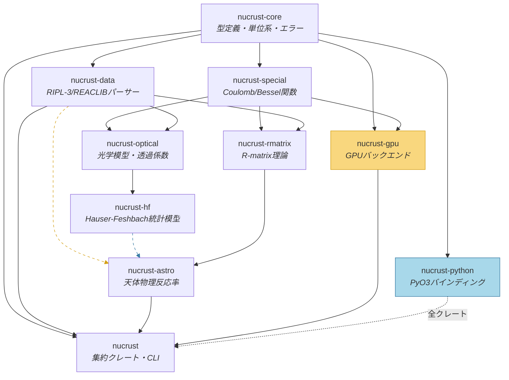
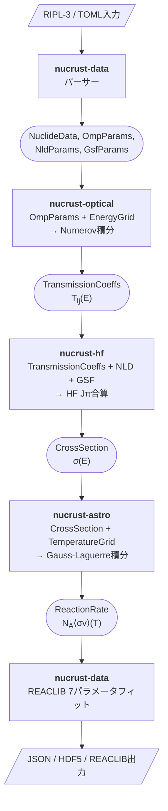
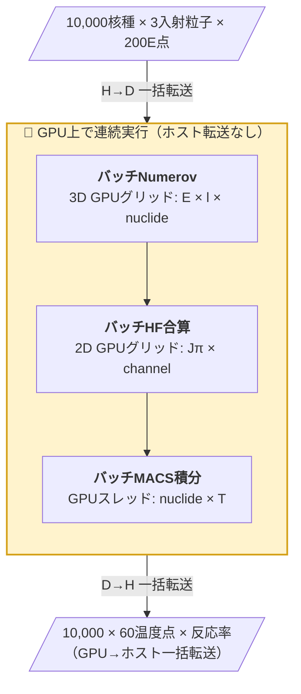
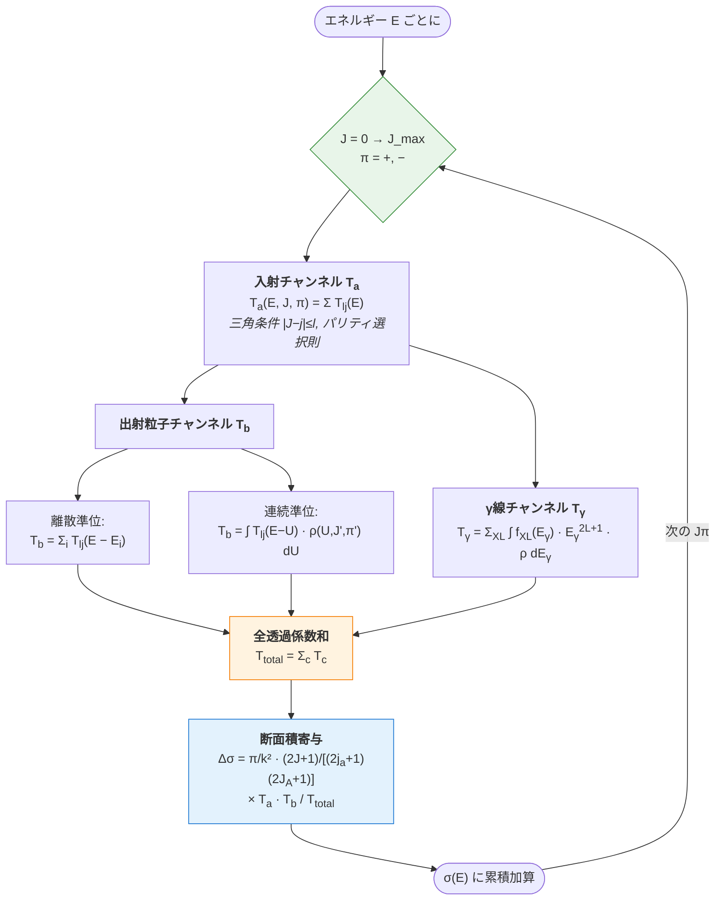

# nucrust 詳細設計書 (Technical Design Document)

> **⚠️ ステータス: 凍結（歴史的設計文書）** — 本文書は設計フェーズのスナップショットであり、以後更新されません。実装過程で生じた変更は反映されていないため、現在の仕様の根拠としては `book/`（mdBook ユーザーガイド）と rustdoc を、実装状況は `CHANGELOG.md` / `task.md` を参照してください。（2026-06-12 注記）

> **Version:** 1.1.0
> **Date:** 2026-03-22
> **Base Document:** nucrust SRS v0.2.1-draft

### 改訂履歴

| バージョン | 日付 | 概要 |
|-----------|------|------|
| 0.1.0 | 2026-03-17 | 初版 |
| 0.2.0 | 2026-03-17 | SRS Authorレビュー反映: `SpinParity::two_j` を `i32` に変更し三角条件ヘルパー追加、`ComputeBackend` のNLD/GSF受け渡しをパラメータバッファ方式に変更、`CollisionMatrix` 型定義追加、カスケード計算を明示的スタック方式に変更、`CubicSpline` 補間器追加、MCMC結果のストリーミング出力対応、CODATA 2022に更新、RQ-08をPhase 2に繰り上げ、`nom` パーサー選択をTBD化 |
| 1.0.0 | 2026-03-17 | RQ-01〜RQ-09リサーチ結果統合による最終版: Thompson-Barnett COULCCアルゴリズム完全数式化（CF1/CF2係数・修正Lentz法・6計算領域・Wronskian結合）、RIPL-3フォーマット仕様確定（Fortran FORMAT文字列・欠損値規則）、mpmath検証グリッド策定（Tier 1-3）、Moldauer WFC公式詳細化（Kawano-Talouパラメータ化）、Brune変換の非線形固有値問題定式化、cudarc v0.19 API対応（`CudaContext`+`CudaStream`・cuSOLVER推奨）、結合チャンネル光学模型手法追加、GPU Coulomb関数戦略策定（テーブル→オンザフライ段階的実装）、hipify互換設計ガイドライン策定・CubeCL FP64非対応確認、パーサー方針を`&str`スライス方式に確定 |
| 1.1.0 | 2026-03-22 | Phase 1-2実装結果に基づく設計反映: (1) `HfConfig`のバックエンド用/物理計算用二重定義を文書化、(2) 結合チャンネル型（`DeformationParams`, `CoupledState`, `RotationalBand`, `CoupledTransmission`, `TransmissionOutput`）を§3.1に追加、(3) Wigner記号モジュール（3j/6j/Clebsch-Gordan/縮約行列要素）を§3.6に追加、(4) HF計算コンテキスト構造体`HfCalculation`を§7.1に反映、(5) feature flag設計を段階的導入方針に更新 |

---

## 目次

1. [設計方針と全体構成](#1-設計方針と全体構成)
2. [クレート依存関係とデータフロー](#2-クレート依存関係とデータフロー)
3. [nucrust-core 詳細設計](#3-nucrust-core-詳細設計)
4. [nucrust-special 詳細設計](#4-nucrust-special-詳細設計)
5. [nucrust-data 詳細設計](#5-nucrust-data-詳細設計)
6. [nucrust-optical 詳細設計](#6-nucrust-optical-詳細設計)
7. [nucrust-hf 詳細設計](#7-nucrust-hf-詳細設計)
8. [nucrust-rmatrix 詳細設計](#8-nucrust-rmatrix-詳細設計)
9. [nucrust-astro 詳細設計](#9-nucrust-astro-詳細設計)
10. [nucrust-gpu 詳細設計](#10-nucrust-gpu-詳細設計)
11. [nucrust-python 詳細設計](#11-nucrust-python-詳細設計)
12. [nucrust CLI 詳細設計](#12-nucrust-cli-詳細設計)
13. [テストアーキテクチャ](#13-テストアーキテクチャ)
14. [リサーチ要求事項（全件解決済み）](#14-リサーチ要求事項全件解決済み)

---

## 1. 設計方針と全体構成

### 1.1 設計原則

| 原則 | 説明 |
|------|------|
| **型駆動設計** | 物理的な不変条件（エネルギー $\geq 0$、$T_l \in [0,1]$ 等）を型システムで保証する |
| **ゼロコスト抽象化** | トレイトの静的ディスパッチ、ジェネリクスによるモノモーフィゼーション |
| **バックエンド透過性** | `ComputeBackend`トレイトにより、物理コードがCPU/GPUを意識しない |
| **データ局所性** | SoA (Struct of Arrays) レイアウトによるキャッシュ/GPU効率の最大化 |
| **フェイルファスト** | 不正なパラメータは構築時にバリデーション、`Result`で明示的エラー |
| **テスタビリティ** | 全モジュールが依存注入可能、モックバックエンド提供 |

### 1.2 ワークスペースディレクトリ構成

```
nucrust/
├── Cargo.toml                      # ワークスペースルート
├── crates/
│   ├── nucrust-core/               # 型定義、単位系、エラー
│   ├── nucrust-special/            # Coulomb/Bessel関数
│   ├── nucrust-data/               # RIPL-3/REACLIBパーサー
│   ├── nucrust-optical/            # 光学模型・透過係数
│   ├── nucrust-hf/                 # Hauser-Feshbach統計模型
│   ├── nucrust-rmatrix/            # R-matrix理論
│   ├── nucrust-astro/              # 天体物理反応率
│   ├── nucrust-gpu/                # GPUバックエンド
│   ├── nucrust-python/             # PyO3バインディング
│   └── nucrust/                    # 集約クレート・CLI
├── benches/                        # Criterionベンチマーク
├── book/                           # mdbookユーザーガイド
├── kernels/                        # CUDA Cカーネルソース
│   ├── numerov.cu
│   ├── hf_summation.cu
│   ├── rmatrix_solve.cu
│   └── macs_integral.cu
├── tests/
│   ├── reference_data/             # TALYS/AZURE2ゴールデンファイル
│   └── integration/                # クレート横断統合テスト
└── data/                           # テスト用小規模データ
    ├── ripl3_sample/
    └── reaclib_sample/
```

### 1.3 feature flag設計

ワークスペースルート `Cargo.toml` で統一管理する。段階的に導入し、各Phaseで必要になったflagから有効化する:

```toml
[workspace.features]
default = ["parallel"]
parallel = ["rayon"]         # Phase 2後半〜: CPU並列化
simd = ["wide"]              # Phase 2後半〜: SIMD Coulomb関数バッチ
gpu = ["cudarc", "nucrust-gpu"]  # Phase 3〜
hdf5 = ["hdf5-metno"]       # Phase 2後半〜
python = ["pyo3", "numpy"]   # Phase 4〜
ffi = []                     # C ABI公開
gsl-fallback = ["rgsl"]      # Coulomb関数GSLフォールバック
```

> **実装メモ (v1.1.0):** Phase 1-2の初期段階ではfeature flagは未配線（`default = []`）。各クレートの核心アルゴリズムの正確性を優先して検証した後、Phase 2後半以降でfeature flagを段階的に有効化する。

---

## 2. クレート依存関係とデータフロー

### 2.1 依存関係グラフ



> **凡例:** 実線 = 必須依存、破線 = feature flag依存（`gpu`, `python`）

### 2.2 エンドツーエンドデータフロー

**単一核種の反応率計算パイプライン:**



**バッチ計算（B6問題）でのGPUパイプライン:**



---

## 3. nucrust-core 詳細設計

### 3.1 型システム

#### 3.1.1 核種識別

```rust
/// 核種識別子（不変、Copy、ハッシュ可能）
#[derive(Debug, Clone, Copy, PartialEq, Eq, Hash)]
pub struct Nuclide {
    z: u16,     // 原子番号 Z (0–118)
    a: u16,     // 質量数 A (1–350)
}

impl Nuclide {
    /// バリデーション付きコンストラクタ
    pub fn new(z: u16, a: u16) -> Result<Self, CoreError> {
        if z > 118 || a == 0 || a > 350 || (a as i32) < (z as i32) {
            return Err(CoreError::InvalidNuclide { z, a });
        }
        Ok(Self { z, a })
    }

    pub fn n(&self) -> u16 { self.a - self.z }  // 中性子数 N
    pub fn z(&self) -> u16 { self.z }
    pub fn a(&self) -> u16 { self.a }
}
```

#### 3.1.2 粒子型

```rust
/// 入射・出射粒子の種別
#[derive(Debug, Clone, Copy, PartialEq, Eq, Hash)]
pub enum Projectile {
    Neutron,      // n
    Proton,       // p
    Deuteron,     // d
    Triton,       // t
    Helion,       // ³He
    Alpha,        // α
    Gamma,        // γ
}

impl Projectile {
    pub fn z(&self) -> u16 { ... }
    pub fn a(&self) -> u16 { ... }
    pub fn mass_amu(&self) -> f64 { ... }
    pub fn spin(&self) -> f64 { ... }       // n=1/2, p=1/2, d=1, t=1/2, ³He=1/2, α=0, γ=1
    pub fn is_charged(&self) -> bool { ... }
}
```

#### 3.1.3 反応チャンネル

```rust
/// 反応チャンネル (entrance or exit)
#[derive(Debug, Clone)]
pub struct Channel {
    pub projectile: Projectile,
    pub target: Nuclide,
    pub q_value: f64,             // Q値 (MeV)
}

/// スピン・パリティ量子数
#[derive(Debug, Clone, Copy, PartialEq, Eq, Hash)]
pub struct SpinParity {
    /// 2J (整数表現、半整数を避ける): J=5/2 → two_j=5
    /// i32を使用: チャンネルスピン結合の三角条件 |J - j_a| ≤ l ≤ J + j_a で
    /// two_j同士の減算が頻出するため、u32のアンダーフローを回避する
    pub two_j: i32,
    pub parity: Parity,
}

impl SpinParity {
    pub fn new(two_j: i32, parity: Parity) -> Result<Self, CoreError> {
        if two_j < 0 {
            return Err(CoreError::InvalidParameter {
                name: "two_j", value: two_j as f64, reason: "must be non-negative",
            });
        }
        Ok(Self { two_j, parity })
    }

    /// 三角条件判定: |j1 - j2| ≤ j3 ≤ j1 + j2 (すべて2J表現)
    pub fn triangle_condition(two_j1: i32, two_j2: i32, two_j3: i32) -> bool {
        let diff = (two_j1 - two_j2).abs();
        let sum = two_j1 + two_j2;
        two_j3 >= diff && two_j3 <= sum && (two_j1 + two_j2 + two_j3) % 2 == 0
    }
}

#[derive(Debug, Clone, Copy, PartialEq, Eq, Hash)]
pub enum Parity {
    Positive,
    Negative,
}

impl Parity {
    pub fn from_sign(sign: i8) -> Self { ... }
    pub fn sign(&self) -> i8 { ... }   // +1 or -1
}
```

#### 3.1.4 エネルギーグリッド

```rust
/// エネルギーグリッド（ソート済み、正値を保証）
#[derive(Debug, Clone)]
pub struct EnergyGrid {
    values: Vec<f64>,  // MeV, ソート済み、全て > 0
}

impl EnergyGrid {
    pub fn logarithmic(e_min: f64, e_max: f64, n_points: usize) -> Result<Self, CoreError>;
    pub fn linear(e_min: f64, e_max: f64, n_points: usize) -> Result<Self, CoreError>;
    pub fn from_values(values: Vec<f64>) -> Result<Self, CoreError>;
    pub fn len(&self) -> usize;
    pub fn as_slice(&self) -> &[f64];
}

/// 3次スプライン補間器
///
/// MACS計算のGauss-Laguerre求積ノード上での断面積評価に必要。
/// 求積ノードエネルギーはユーザー定義グリッド点と一般に一致しない。
pub struct CubicSpline {
    x: Vec<f64>,
    y: Vec<f64>,
    coeffs: Vec<[f64; 4]>,  // 各区間の a, b, c, d 係数
}

impl CubicSpline {
    /// 自然スプライン（端点で二次微分 = 0）を構築
    pub fn natural(x: &[f64], y: &[f64]) -> Result<Self, CoreError>;
    /// 指定点での補間値を返す
    pub fn evaluate(&self, x: f64) -> f64;
    /// 複数点を一括評価（ソート済み入力で高速）
    pub fn evaluate_batch(&self, xs: &[f64]) -> Vec<f64>;
}
```

#### 3.1.5 計算結果の出力型

```rust
/// 透過係数テーブル T_{l,j}(E)
/// SoAレイアウト: GPUバッチ転送に最適化
pub struct TransmissionCoeffs {
    pub energy: EnergyGrid,
    pub l_max: u32,
    /// data[l][j_index][e_index] — j_index: 0 = l-1/2, 1 = l+1/2
    /// 連続メモリ配置: [l0_j0_e0, l0_j0_e1, ..., l0_j1_e0, ..., l1_j0_e0, ...]
    pub data: Vec<f64>,
}

/// 断面積テーブル σ(E)
pub struct CrossSection {
    pub energy: EnergyGrid,
    pub sigma_total: Vec<f64>,       // 全断面積 (mb)
    pub sigma_elastic: Vec<f64>,     // 弾性散乱断面積
    pub sigma_reaction: Vec<f64>,    // 反応断面積
    /// チャンネル別の部分断面積
    pub partial: Vec<PartialCrossSection>,
}

pub struct PartialCrossSection {
    pub channel: Channel,
    pub sigma: Vec<f64>,    // mb, energy gridに対応
}

/// 衝突行列 $U_{cc'}(E)$
/// `ComputeBackend::rmatrix_solve` と `RMatrixResult` の共通戻り値型
pub struct CollisionMatrix {
    pub energies: Vec<f64>,
    pub n_channels: usize,
    /// U行列要素: [energy_index * n_ch * n_ch + c * n_ch + c'] (SoAレイアウト)
    pub u_matrix: Vec<Complex64>,
}

/// 天体物理反応率
pub struct ReactionRate {
    pub temperatures: Vec<f64>,      // GK
    pub na_sigma_v: Vec<f64>,        // cm³/mol/s
    pub macs: Option<Vec<f64>>,      // mb (kTごとのMACS)
    pub s_factor: Option<Vec<f64>>,  // MeV·b (荷電粒子のみ)
    pub sef: Option<Vec<f64>>,       // 恒星増強因子
}
```

#### 3.1.6 結合チャンネル型 (v1.1.0追加)

§6.5の結合チャンネル光学模型で必要となる型を `nucrust-core` で定義する。球形・結合チャンネル両方の結果を統一的に扱うため、`TransmissionOutput` enumで分岐する。

```rust
/// 変形パラメータ（軸対称核）
///
/// 核表面: R(θ) = R₀[1 + Σ_λ β_λ Y_{λ0}(θ)]
#[derive(Debug, Clone, Copy)]
pub struct DeformationParams {
    pub beta2: f64,    // 四重極変形 β₂
    pub beta3: f64,    // 八重極変形 β₃
    pub beta4: f64,    // 十六重極変形 β₄
}

impl DeformationParams {
    pub fn quadrupole(beta2: f64) -> Self;
    pub fn quadrupole_hexadecapole(beta2: f64, beta4: f64) -> Self;
    /// 閾値を超える変形があるか判定
    pub fn is_deformed(&self, threshold: f64) -> bool;
    /// 非ゼロの変形多極子とそのβ値を列挙
    pub fn multipoles(&self) -> Vec<(u32, f64)>;
}

/// 結合チャンネル内の1状態
#[derive(Debug, Clone)]
pub struct CoupledState {
    pub index: usize,
    pub spin_parity: SpinParity,
    pub excitation_energy: f64,    // 基底状態からの励起エネルギー (MeV)
}

/// 偶偶核の基底状態回転バンド: 0⁺, 2⁺, 4⁺, 6⁺, ...
/// E(I) = (ℏ²/2𝒥) I(I+1)
#[derive(Debug, Clone)]
pub struct RotationalBand {
    pub states: Vec<CoupledState>,
}

impl RotationalBand {
    /// 偶偶核の回転バンド生成（実験値がない場合は剛体回転子公式で外挿）
    pub fn even_even(max_spin: u32, energies: &[f64]) -> Self;
    pub fn n_states(&self) -> usize;
}

/// 光学模型計算の出力: 球形 or 結合チャンネル
#[derive(Debug, Clone)]
pub enum TransmissionOutput {
    /// 球形（非結合）透過係数
    Spherical(TransmissionCoeffs),
    /// 結合チャンネル衝突行列 + 対角透過係数
    Coupled(CoupledTransmission),
}

/// 結合チャンネル透過結果
#[derive(Debug, Clone)]
pub struct CoupledTransmission {
    pub collision_matrix: CollisionMatrix,
    /// 対角要素から抽出: T_c(E) = 1 - |U_{cc}|²（HF計算への入力）
    pub diagonal_transmission: TransmissionCoeffs,
    pub band: RotationalBand,
}
```

### 3.2 単位系

型レベルでの単位強制は行わない（計算コストとAPIの複雑化を避ける）。
代わりに、内部表現の単位規約をドキュメントで厳密に定義し、変換関数を提供する。

```rust
/// 内部単位規約（全モジュール共通）
/// - エネルギー: MeV
/// - 長さ: fm
/// - 時間: s
/// - 断面積: mb (10⁻²⁷ cm²)
/// - 温度: GK (10⁹ K)
/// - 反応率: cm³/mol/s
/// - 質量: amu (原子質量単位)
pub mod units {
    // 物理定数 (CODATA 2022)
    // 核物理コードでは定数バージョンを固定する慣行に従い、明示的にCODATA 2022を選択
    pub const HBAR_C: f64 = 197.3269804;          // ℏc (MeV·fm)
    pub const AMU_MEV: f64 = 931.49410372;         // 1 amu in MeV/c²
    pub const FINE_STRUCTURE: f64 = 7.2973525643e-3; // α (微細構造定数)
    pub const BOLTZMANN_MEV: f64 = 8.617333262e-2;  // k_B (MeV/GK)
    pub const AVOGADRO: f64 = 6.02214076e23;       // N_A (1/mol) — 2019年再定義で正確値

    // 変換関数
    pub fn mev_to_kev(e: f64) -> f64 { e * 1e3 }
    pub fn barn_to_mb(s: f64) -> f64 { s * 1e3 }
    pub fn sommerfeld_parameter(z1: f64, z2: f64, mu_amu: f64, e_cm_mev: f64) -> f64;
    pub fn wave_number(mu_amu: f64, e_cm_mev: f64) -> f64;       // k (fm⁻¹)
    pub fn reduced_mass(m1_amu: f64, m2_amu: f64) -> f64;         // μ (amu)
    pub fn cm_energy(e_lab: f64, m_proj: f64, m_targ: f64) -> f64; // E_cm (MeV)
}
```

### 3.3 エラー階層

```rust
/// クレート横断のエラー列挙型
#[derive(Debug, thiserror::Error)]
pub enum CoreError {
    // --- バリデーション ---
    #[error("Invalid nuclide: Z={z}, A={a}")]
    InvalidNuclide { z: u16, a: u16 },

    #[error("Energy out of range: {value} MeV (expected {min}..{max})")]
    EnergyOutOfRange { value: f64, min: f64, max: f64 },

    #[error("Invalid parameter: {name} = {value} ({reason})")]
    InvalidParameter { name: &'static str, value: f64, reason: &'static str },

    // --- 数値計算 ---
    #[error("Convergence failure in {algorithm} after {iterations} iterations (residual: {residual:.2e})")]
    ConvergenceFailure { algorithm: &'static str, iterations: u32, residual: f64 },

    #[error("Numerical overflow/underflow in {context}")]
    NumericalOverflow { context: &'static str },

    // --- データ ---
    #[error("Data not found: {description}")]
    DataNotFound { description: String },

    #[error("Parse error in {file} at line {line}: {message}")]
    ParseError { file: String, line: usize, message: String },

    // --- I/O ---
    #[error("I/O error: {0}")]
    Io(#[from] std::io::Error),
}
```

各クレート固有のエラーは独自のエラー型を定義し、`CoreError`への`From`変換を実装する。

### 3.4 バックエンドトレイト

```rust
/// 計算バックエンドの抽象化
///
/// CPU/GPU実装の切り替えはこのトレイトを通じて行う。
/// 各メソッドはバッチ処理を前提とし、単一計算はバッチサイズ1として扱う。
pub trait ComputeBackend: Send + Sync {
    /// バッチNumerov積分: 複数の(E, l, nuclide)組に対する透過係数
    fn batch_numerov(
        &self,
        params: &[NumerovTask],
        config: &NumerovConfig,
    ) -> Result<TransmissionCoeffs, CoreError>;

    /// Hauser-Feshbach Jπ合算
    ///
    /// NLD/GSFはトレイトオブジェクトではなくパラメータバッファとして受け渡す。
    /// 理由: GPUバックエンドでは `dyn LevelDensity` の vtable はホスト側にあり、
    /// CUDAカーネルから呼び出せない。GPU実装ではモデル種別enum + パラメータを
    /// デバイスメモリに転送し、カーネル内で直接計算する。
    fn hf_summation(
        &self,
        tc: &TransmissionCoeffs,
        nld_params: &NldModelParams,
        gsf_params: &GsfModelParams,
        config: &HfConfig,
    ) -> Result<CrossSection, CoreError>;

    /// R-matrix衝突行列計算（エネルギー点並列）
    fn rmatrix_solve(
        &self,
        rmatrix: &RMatrixParams,
        energies: &[f64],
    ) -> Result<CollisionMatrix, CoreError>;

    /// MACS積分（核種×温度バッチ）
    fn macs_integrate(
        &self,
        cross_sections: &[CrossSection],
        temperatures: &[f64],
        config: &MacsConfig,
    ) -> Result<Vec<ReactionRate>, CoreError>;
}

/// NLDモデルのGPU転送可能なパラメータ表現
///
/// `dyn LevelDensity`はCPU側でのみ使用。GPU転送時は`LevelDensity::to_params()`で
/// この列挙型に変換し、デバイスメモリに格納する。
pub enum NldModelParams {
    GilbertCameron { a: f64, delta: f64, t: f64, e0: f64, e_match: f64, sigma: f64 },
    Bsfg { a: f64, delta: f64, sigma: f64 },
    ConstantTemperature { t: f64, e0: f64 },
    Ignatyuk { a_tilde: f64, delta_w: f64, gamma: f64, delta: f64 },
    HfbTable { excitations: Vec<f64>, spins: Vec<f64>, densities: Vec<f64> },
}

/// GSFモデルのGPU転送可能なパラメータ表現
pub enum GsfModelParams {
    Slo { e_gdr: f64, gamma_gdr: f64, sigma_gdr: f64 },
    Eglo { e_gdr: f64, gamma_gdr: f64, sigma_gdr: f64, temperature: f64 },
    QrpaTable { energies: Vec<f64>, strengths_e1: Vec<f64>, strengths_m1: Vec<f64> },
}

/// `LevelDensity` / `GammaStrength` トレイトからパラメータを抽出するための変換トレイト
pub trait ToDeviceParams {
    type Params;
    fn to_params(&self, nuclide: &Nuclide) -> Self::Params;
}

/// CPUバックエンド
/// CpuBackendは `nucrust` 集約クレートに実装する（全下流クレートへのアクセスが必要なため）。
pub struct CpuBackend;

/// GPUバックエンド（cudarc v0.19 + CUDA C）— feature "gpu"
///
/// cudarc v0.19の破壊的変更に対応: CudaDevice → CudaContext + CudaStream
/// CudaContext, CudaSlice<T>, CudaStream, CudaBlas はすべて Send + Sync
#[cfg(feature = "gpu")]
pub struct GpuBackend {
    ctx: Arc<CudaContext>,
    stream: CudaStream,
    modules: GpuModuleCache,
    blas: CudaBlas,
}
```

### 3.5 物理モデルプラグイントレイト

```rust
/// 核レベル密度モデル
pub trait LevelDensity: Send + Sync {
    /// ρ(U, J, π) — 励起エネルギーU, スピンJ, パリティπにおけるレベル密度
    fn rho(&self, nuclide: &Nuclide, excitation: f64, spin: f64, parity: Parity) -> f64;

    /// 全レベル密度 ρ_tot(U) = Σ_{J,π} (2J+1) ρ(U, J, π)
    fn rho_total(&self, nuclide: &Nuclide, excitation: f64) -> f64;

    /// モデル名（ログ・出力用）
    fn name(&self) -> &str;
}

/// γ線強度関数モデル
pub trait GammaStrength: Send + Sync {
    /// f_{XL}(E_γ) — 多極子XL (E1, M1, E2, ...) のγ線強度関数
    fn strength(&self, nuclide: &Nuclide, e_gamma: f64, multipole: Multipole) -> f64;
    fn name(&self) -> &str;
}

/// 光学模型ポテンシャル
pub trait OpticalPotential: Send + Sync {
    /// V(r, E, l, j) — 動径rにおける複素ポテンシャル値
    /// 戻り値: (実部, 虚部) in MeV
    fn potential(&self, r: f64, e_cm: f64, l: u32, j: f64, channel: &Channel) -> Complex64;

    /// Coulomb半径 R_C (fm)
    fn coulomb_radius(&self, channel: &Channel) -> f64;

    /// マッチング半径 R_match (fm) — 核力が無視できる境界
    fn matching_radius(&self, channel: &Channel) -> f64;
    fn name(&self) -> &str;
}

#[derive(Debug, Clone, Copy)]
pub enum Multipole {
    E1, M1, E2, M2, E3,
}
```

> **実装メモ (v1.1.0): `HfConfig` の二重定義について**
>
> `nucrust-core::backend::HfConfig` はバックエンドトレイトのシグネチャ用（GPU転送可能なパラメータのみ: `j_max`, `max_particle_stages`, `max_gamma_steps`, `wfc_model`）。`nucrust-hf::HfConfig` はCPU物理計算用（より詳細: `two_j_max`, `wfc_quadrature`, `exit_channels: Vec<Projectile>` 等を含む）。
>
> この分離は**バックエンド透過性**の設計原則の帰結: GPU側ではNLD/GSFをパラメータバッファとして受け渡すのと同様に、設定もGPU転送可能な最小セットに制限する。CPU側ではトレイトオブジェクト（`&dyn LevelDensity`）を直接使用できるため、より豊富な設定をサポートする。

### 3.6 角運動量結合: Wigner記号 (v1.1.0追加)

結合チャンネル光学模型（§6.5.3）の変形ポテンシャル行列要素計算に必要なWigner 3j/6j記号、Clebsch-Gordan係数、球面調和関数の縮約行列要素を `nucrust-core::wigner` で提供する。

全角運動量引数は半整数を正確に扱うため **twice-j 規約**（2j整数）を使用する。

```rust
/// Wigner 3j記号
///
/// ⎛ j1  j2  j3 ⎞
/// ⎝ m1  m2  m3 ⎠
///
/// 全引数は 2j, 2m。選択則違反時は 0 を返す。
/// Racahの公式＋対数階乗による数値安定な実装。
pub fn wigner_3j(two_j1: i32, two_j2: i32, two_j3: i32,
                 two_m1: i32, two_m2: i32, two_m3: i32) -> f64;

/// Clebsch-Gordan係数 ⟨j1 m1; j2 m2 | j3 m3⟩
///
/// Wigner 3jとの関係:
/// ⟨j1 m1; j2 m2 | j3 m3⟩ = (-1)^(j1-j2+m3) √(2j3+1) × (j1 j2 j3; m1 m2 -m3)
pub fn clebsch_gordan(two_j1: i32, two_m1: i32, two_j2: i32,
                      two_m2: i32, two_j3: i32, two_m3: i32) -> f64;

/// Wigner 6j記号
///
/// ⎧ j1  j2  j3 ⎫
/// ⎩ j4  j5  j6 ⎭
///
/// 4つの三角条件を検証し、Racahの公式で評価。
pub fn wigner_6j(two_j1: i32, two_j2: i32, two_j3: i32,
                 two_j4: i32, two_j5: i32, two_j6: i32) -> f64;

/// 球面調和関数の縮約行列要素 ⟨l ‖ Y_λ ‖ l'⟩
///
/// = (-1)^l × √((2l+1)(2λ+1)(2l'+1) / 4π) × (l λ l'; 0 0 0)
///
/// §6.5.3の結合ポテンシャル行列要素で使用。
pub fn reduced_matrix_element_y(l: u32, lambda: u32, l_prime: u32) -> f64;
```

---

## 4. nucrust-special 詳細設計

### 4.1 概要

Coulomb波動関数 $F_l(\eta, \rho)$, $G_l(\eta, \rho)$ およびその導関数の純Rust実装。
Thompson-Barnett COULCCアルゴリズム（J. Comp. Phys. 64, 490, 1986）のクリーンルーム実装。

**数学的参照:** DLMF Chapter 33, Abramowitz & Stegun Chapter 14から導出する。

### 4.2 公開API

```rust
/// Coulomb波動関数の計算結果
#[derive(Debug, Clone)]
pub struct CoulombResult {
    pub f: Vec<f64>,       // F_l(η, ρ), l = l_min..l_min+n_l
    pub g: Vec<f64>,       // G_l(η, ρ)
    pub fp: Vec<f64>,      // F'_l(η, ρ)
    pub gp: Vec<f64>,      // G'_l(η, ρ)
    pub sigma: Vec<f64>,   // σ_l = arg[Γ(l+1+iη)] (Coulomb位相差)
    pub exponent: f64,     // 指数スケーリング因子（アンダーフロー回避）
}

/// Coulomb波動関数の計算
///
/// # Arguments
/// * `eta`   - Sommerfeldパラメータ η
/// * `rho`   - 無次元動径 ρ = k·r
/// * `l_min` - 最小軌道角運動量
/// * `n_l`   - 計算する部分波の数
///
/// # Returns
/// F_l, G_l, F'_l, G'_l, σ_l を l = l_min..l_min+n_l について返す
pub fn coulomb_wave(
    eta: f64,
    rho: f64,
    l_min: u32,
    n_l: u32,
) -> Result<CoulombResult, SpecialError>;

/// バッチCoulomb波動関数計算（SIMDまたはGPU用）
/// 複数の(η, ρ)組を同時に計算する
pub fn coulomb_wave_batch(
    eta: &[f64],
    rho: &[f64],
    l_min: u32,
    n_l: u32,
) -> Result<Vec<CoulombResult>, SpecialError>;
```

### 4.3 アルゴリズム構成

#### 4.3.1 計算領域の選択

古典的転回点 $\rho_\mathrm{tp}$ を基準に6つの計算領域を判別する:

$$\rho_\mathrm{tp} = \eta + \sqrt{\eta^2 + l(l+1)}$$

| ケース | 条件 | 使用手法 | 備考 |
|--------|------|---------|------|
| 1 | 中程度 $|\rho|$、転回点内部 | $_{1}F_{1}$ べき級数から $F_l$ を算出 | 小 $|\rho|$ での主要手法 |
| 2 | 複素 $\rho, \eta$ | CF2(+) と CF2(−) の両方を評価 | 一般複素引数用 |
| 3 | 実 $\rho, \eta$、$|\rho| > 0.5$ | **Steed法**（CF1 + CF2 + 共役利用） | **最も効率的**、実引数デフォルト |
| 4 | $|\rho| \gg |\eta|^2 + |l|$ | $_{2}F_{0}$ 漸近展開 + Padé加速 | 大 $\rho$ の漸近領域 |
| 5 | $|\rho| < 0.5$、非整数 $l$ | $F_l$ と $F_{l'=-l-1}$ から $H^\omega$ を構成 | 原点近傍の非整数 $l$ |
| 6 | $|\rho| < 0.5$、整数 $l$ | 対数表現（L'Hôpital極限） | 原点近傍の整数 $l$ |

**境界判定基準:**

- $|\rho| < 0.5$ → ケース5（非整数 $l$）またはケース6（整数 $l$）
- 実 $\rho, \eta$ かつ $|\rho| > 0.5$ → ケース3（Steed法、最優先）
- 大 $|\rho|$: $|\rho| > \mathrm{ASYM} \times C_{lA}$（ASYM = 3.0）→ ケース4
- 複素引数 → ケース2
- CF1A と CF1 の切替は ASYM パラメータで制御

#### 4.3.2 連分数CF1: $f_l = F'_l / F_l$

DLMF §33.8 Eq.33.8.1 に基づく実数連分数。補助量:

$$R_l = \sqrt{1 + \eta^2/l^2}, \qquad S_l = l/\rho + \eta/l, \qquad T_l = S_l + S_{l+1}$$

CF1は標準連分数 $b_0 + a_1/(b_1 + a_2/(b_2 + \cdots))$ の形式で:

- **初期値:** $b_0 = S_{l+1}$
- **$n \geq 1$ の部分分子:** $a_n = -R^2_{l+n} = -(1 + \eta^2/(l+n)^2)$
- **$n \geq 1$ の部分分母:** $b_n = T_{l+n} = \frac{l+n}{\rho} + \frac{\eta}{l+n} + \frac{l+n+1}{\rho} + \frac{\eta}{l+n+1}$

CF1は全ての有限 $\rho$ で収束し、収束に約 $|\rho|$ 回の反復を要する。

修正Lentz法（Lentz-Thompson-Barnett法）で評価する:

```rust
/// 修正Lentz法による連分数評価
///
/// f = b_0 + a_1/(b_1 + a_2/(b_2 + ...))
///
/// アルゴリズム:
///   small = 1e-50 (ゼロ除算回避)
///   h₀ = b₀ (h₀=0 なら h₀=small)
///   D₀ = 0, C₀ = h₀
///   n ≥ 1:
///     Dₙ = bₙ + aₙ·D_{n-1}  (Dₙ=0 なら Dₙ=small)
///     Cₙ = bₙ + aₙ/C_{n-1}  (Cₙ=0 なら Cₙ=small)
///     Dₙ = 1/Dₙ
///     Δₙ = Cₙ·Dₙ
///     hₙ = h_{n-1}·Δₙ
///     収束判定: |Δₙ − 1| < ε
///
/// 実数・複素数の両方に適用可能。
fn continued_fraction_lentz<T: ComplexFloat>(
    a: impl Fn(u32) -> T,     // 部分分子 a_n
    b: impl Fn(u32) -> T,     // 部分分母 b_n
    max_iter: u32,             // 最大反復数 (20,000)
    eps: f64,                  // 収束閾値 (1e-15)
) -> Result<T, SpecialError>;
```

#### 4.3.3 連分数CF2: $p + iq = H^{+\prime}_l / H^+_l$

DLMF §33.8 Eq.33.8.2 に基づく複素連分数。$H^+ = G + iF$（出射波関数）の対数微分。

定数: $a = 1+l+i\eta$, $b = -l+i\eta$

- **初期値:** $b_0 = i(1 - \eta/\rho)$
- **$n \geq 1$ の部分分子:** $a_n = (n+l+i\eta)(n-1-l+i\eta)$
- **$n \geq 1$ の部分分母:** $b_n = 2(\rho - \eta + ni)$

CF2は $\rho \neq 0$ で収束する。$|\rho|$ が大きいほど収束は速く、$|\rho| < 0.5$ では収束が極めて遅いため他の方法（べき級数）が必要となる。

**禁止領域での $\rho$ シフト戦略:** CF2が禁止領域で収束しない場合、$\rho \to \rho' = \rho + \Delta\rho$（$\rho' > \rho_\mathrm{tp}$）にシフトしてCF2を評価し、Coulomb ODEを逆方向に積分して $\rho$ での値を得る。

#### 4.3.4 Wronskian結合（Steed法）

CF1から $f = F'_l/F_l$ を、CF2から $p + iq = H^{+\prime}_l/H^+_l$ を得た後、Wronskian関係 $W(F, G) = FG' - F'G = 1$ で結合する（DLMF §33.8 Eqs.33.8.4-5）:

$$F_l = \pm\left[\frac{1}{q} \cdot \left((f-p)^2 + q^2\right)\right]^{-1/2}$$

$$F'_l = f \cdot F_l$$

$$G_l = \frac{(f - p) \cdot F_l}{q}$$

$$G'_l = \frac{(f \cdot p - p^2 - q^2) \cdot F_l}{q}$$

符号 $\pm$ はCF1の最終収束値の符号と一致させる。

#### 4.3.5 三項漸化式（DLMF §33.4）

任意のCoulomb関数 $X_l$（$F_l$, $G_l$, $H^\pm_l$ のいずれか）に対し:

$$R_l \cdot X_{l-1} - T_l \cdot X_l + R_{l+1} \cdot X_{l+1} = 0$$

微分関係:

$$X'_l = R_l \cdot X_{l-1} - S_l \cdot X_l \qquad (l \geq 1)$$

$$X'_l = S_{l+1} \cdot X_l - R_{l+1} \cdot X_{l+1} \qquad (l \geq 0)$$

**安定性方向:**

- **$F_l$: 下降漸化式** ($l_\mathrm{max} \to l_\mathrm{min}$) — 安定（$F_l$ は $l \to \infty$ で最小解）
- **$G_l$ および $H^\pm_l$: 上昇漸化式** ($l_\mathrm{min} \to l_\mathrm{max}$) — 安定

逆方向の漸化は破壊的に不安定であるため禁止する。

#### 4.3.6 べき級数展開（小 $\rho$）

$$F_l(\eta, \rho) = C_l(\eta) \cdot \rho^{l+1} \cdot \sum_{k=0}^{N} A_k \cdot \rho^k$$

**係数の漸化式:**

$$A_0 = 1, \qquad A_1 = \frac{\eta}{l+1}$$

$$A_k = \frac{2\eta \cdot A_{k-1} - A_{k-2}}{k(2l+1+k)} \qquad (k \geq 2)$$

$C_l(\eta)$ はCoulomb正規化定数（Gamow因子）:

$$C_0(\eta) = \sqrt{\frac{2\pi\eta}{e^{2\pi\eta} - 1}}$$

$$C_l(\eta) = C_{l-1}(\eta) \cdot \frac{\sqrt{l^2 + \eta^2}}{l(2l+1)}$$

$_{1}F_{1}$ 級数は全ての有限 $\rho$ で収束するが、実用的には $|\rho| \lesssim \max(1, 2|\eta|)$ が限界（壊滅的桁落ちのため）。

#### 4.3.7 Coulomb位相差

$\sigma_l = \mathrm{Im}[\ln \Gamma(l + 1 + i\eta)]$ を複素対数ガンマ関数で計算。

**Stirling漸近展開:**

$$\ln \Gamma(z) \sim z \cdot \ln(z) - z + \frac{1}{2} \ln\frac{2\pi}{z} + \sum_{n=1}^{N} \frac{B_{2n}}{2n(2n-1)z^{2n-1}}$$

| $n$ | $B_{2n}/[2n(2n-1)]$ |
|-----|---------------------|
| 1 | $1/12$ |
| 2 | $-1/360$ |
| 3 | $1/1260$ |
| 4 | $-1/1680$ |
| 5 | $1/1188$ |
| 6 | $-691/360360$ |

小 $|z|$ では漸化式 $\ln \Gamma(z+1) = \ln \Gamma(z) + \ln(z)$ で十分大きな引数にシフトしてからStirlingを適用する。

$C_l(\eta)$ も対数ガンマ経由で計算: $C_l(\eta) = 2^l \cdot \exp\left(-\pi\eta/2 + \frac{\ln \Gamma(1+l+i\eta) + \ln \Gamma(1+l-i\eta)}{2} - \ln \Gamma(2l+2)\right)$

```rust
/// 複素対数ガンマ関数 ln Γ(z)
/// Stirling漸近展開（|z| > 10, Bernoulli係数6項）
/// + 漸化式（小引数を漸近領域にシフト）
fn complex_log_gamma(z: Complex64) -> Complex64;
```

#### 4.3.8 指数スケーリング

禁止領域（$\rho \ll \rho_\mathrm{tp}$）では $F_l \sim e^{-\kappa\rho}$（アンダーフロー）、$G_l \sim e^{+\kappa\rho}$（オーバーフロー）であり、浮動小数点範囲を超えうる。

COULCCのMODEパラメータに対応するスケーリングモードを提供:

```rust
/// スケーリングモード
pub enum ScalingMode {
    /// MODE 1: 非スケーリング（通常計算）
    Unscaled,
    /// MODE 2: 指数スケーリング
    /// F̃_l = F_l · exp(+Im(θ)), G̃_l = G_l · exp(-Im(θ))
    Scaled,
}
```

`CoulombResult::exponent`でスケーリング因子 $\mathrm{Im}(\theta)$ を返し、呼び出し側で適切に処理する。

$$F_l = \tilde{F}_l \cdot e^{-\mathrm{exponent}}, \qquad G_l = \tilde{G}_l \cdot e^{+\mathrm{exponent}}$$

### 4.4 SIMDバッチ化

`wide`クレートの`f64x4`を用いて4組の $(\eta, \rho)$ を同時に評価する。
パラメータ依存の収束回数の差（SIMDレーン間のダイバージェンス）に対処するため、パラメータ空間を計算領域でビンニングし、同一ビン内のみSIMDバッチ化する。

### 4.5 検証階層

| 層 | 参照 | カバレッジ | 精度目標 |
|----|------|-----------|---------|
| 第1層 | mpmath 50桁精度 | Tier 1-3テストグリッド（下記） | 相対誤差 $< 10^{-12}$ |
| 第2層 | Thompson-Barnett COULCC.f | 同上 | ビット単位一致 |
| 第3層 | GSL `gsl_coulomb_wave_F_array` | GSLが高精度な領域のみ | 相対誤差 $< 10^{-10}$ |

**検証データ生成:** mpmathの `coulombf`, `coulombg` は合流型超幾何関数 $_{1}F_{1}$ 表現を使用し、桁落ち検出時に内部精度を自動増加する。`mpmath.mp.dps = 60`（50桁＋安全マージン10桁）で生成。$\eta \gg 1$ かつ $\rho \ll \eta$ の準古典的領域では `dps=70–100` を推奨。$\sigma_l$ は `mpmath.im(mpmath.loggamma(l+1+1j*eta))` で計算（`arg(gamma(...))` は大引数でオーバーフローの危険があるため非推奨）。

**推奨テストグリッド:**

| Tier | パラメータ | 目的 |
|------|-----------|------|
| Tier 1（標準） | $(l=0, \eta=0, \rho=1)$, $(l=2, \eta=1.5, \rho=3.5)$, $(l=0, \eta=1, \rho=5)$ | ベッセル極限 $F_0=\sin(\rho)$、A&S表との比較 |
| Tier 2（困難） | $(l=0, \eta=10, \rho=1)$, $(l=0, \eta=100, \rho=1)$, $(l=0, \eta=100, \rho=200)$ | 深い禁止領域 $G_0 \approx 3.09 \times 10^9$、転回点近傍 |
| Tier 3（高 $l$） | $(l=10, \eta=5, \rho=1)$, $(l=30, \eta=10, \rho=100)$ | 高角運動量 |

**自己整合性検証:**

- Wronskian: $F'_l G_l - F_l G'_l = 1$
- 交差積: $F_{l-1} G_l - F_l G_{l-1} = l / \sqrt{l^2 + \eta^2}$
- 微分方程式の残差評価
- 異精度間比較: dps=70 vs dps=100 で50桁の一致を確認

---

## 5. nucrust-data 詳細設計

### 5.1 概要

RIPL-3/REACLIB/STARLIBの入出力を担当するクレート。

> **パーサー実装方針（確定）:** RQ-02の調査結果に基づき、RIPL-3・REACLIB ともに `&str` スライス操作 + `str::parse` 方式を採用する。理由: (1) RIPL-3はFortran FORMAT文字列で列位置が厳密に定義されており、`nom` の文法的柔軟性が不要、(2) REACLIBも74文字固定幅でバイト位置が自明、(3) 外部依存の削減、(4) Fortran固定幅パーサーの実装パターンが `&str::get(start..end)?.trim().parse()` で完結する。

### 5.2 RIPL-3パーサー

#### 5.2.1 対象セクション

| セクション | ファイルパターン | パーサー関数 |
|-----------|-----------------|-------------|
| 質量 | `masses/mass-*.dat` | `parse_mass_table()` |
| 離散準位 | `levels/z???.dat` | `parse_discrete_levels()` |
| 共鳴パラメータ | `resonances/resonances?.dat` | `parse_resonances()` |
| 光学模型 | `optical/om-parameter-u.dat` | `parse_omp_database()` |
| レベル密度 | `densities/total/*.dat`, `densities/microscopic/z???.dat` | `parse_level_density_params()`, `parse_hfb_density_table()` |
| γ線強度 | `gamma/gdr-parameters.dat`, `gamma/gamma-strength/z???.dat` | `parse_gdr_params()`, `parse_gsf_table()` |
| 核分裂障壁 | `fission/fission-barriers-*.dat` | `parse_fission_barriers()` |
| 殻補正 | `shellcorrections/shell-corrections.dat` | `parse_shell_corrections()` |

#### 5.2.2 Fortran固定幅パーシング戦略

RIPL-3はFortran FORMAT文字列に基づく列位置固定のテキストファイルである。
`&str` スライス操作で列位置ベースのパーサーを構築する:

```rust
/// Fortran固定幅フィールドパーサー
///
/// 指定列範囲のバイト列を読み取り、トリム後に型変換する。
/// 空白・"-1"等の欠損値は None を返す。
fn fixed_field_i32(line: &str, start: usize, end: usize) -> Option<i32> {
    line.get(start..end)?.trim().parse().ok()
}
fn fixed_field_f64(line: &str, start: usize, end: usize) -> Option<f64> {
    let s = line.get(start..end)?.trim();
    if s.is_empty() || s == "-1.0" { return None; }
    s.parse().ok()
}
fn fixed_field_str<'a>(line: &'a str, start: usize, end: usize) -> &'a str {
    line.get(start..end).unwrap_or("").trim()
}
```

**離散準位ファイル（最重要）のFortran FORMAT仕様:**

ヘッダ行 FORMAT: `(a5, 6i5, 2f12.6)`

| フィールド | FORMAT | 列 | 内容 |
|-----------|--------|-----|------|
| SYMB | a5 | 1–5 | 質量数+元素記号（例: `"22Mg"`） |
| A | i5 | 6–10 | 質量数 |
| Z | i5 | 11–15 | 原子番号 |
| Nol | i5 | 16–20 | 崩壊スキーム中の準位数 |
| Nog | i5 | 21–25 | γ線数 |
| Nmax | i5 | 26–30 | 完全準位スキームの最大準位番号 |
| Nc | i5 | 31–35 | スピン/パリティが一意な準位番号上限 |
| Sn | f12.6 | 36–47 | 中性子分離エネルギー（MeV） |
| Sp | f12.6 | 48–59 | 陽子分離エネルギー（MeV） |

準位行 FORMAT（2015年更新版）: `(i3, 1x, f10.6, 1x, f5.1, i3, 1x, e10.3, i3, ...)`

| フィールド | FORMAT | 内容 |
|-----------|--------|------|
| Nl | i3 | 準位連番 |
| Elv | f10.6 | 準位エネルギー（MeV） |
| s | f5.1 | スピン（一意割り当て値） |
| p | i3 | パリティ: +1, −1, **0（不明）** |
| T1/2 | e10.3 | 半減期（秒） |
| Ng | i3 | この準位からのγ線数 |
| J | a1 | スピン推定方法フラグ |
| spins | a18 | ENSDF原文のスピン-パリティ文字列 |

γ線行 FORMAT: `(39x, i4, 1x, f10.4, 3(1x, e10.3))`

| フィールド | 内容 |
|-----------|------|
| Nf | 終状態番号 |
| Eg | γ線エネルギー（MeV） |
| Pg | 光子放出確率 |
| Pe | 電磁遷移確率（γ+内部転換+対生成） |
| ICC | 内部転換係数 |

**欠損値の表現規則:**

| 物理量 | 欠損値 | マッピング |
|--------|--------|-----------|
| スピン (J) | $-1.0$ | `Option::None` |
| パリティ (π) | $0$（+1 = 正, −1 = 負） | `Option::None` |
| 半減期 (T1/2) | $-1.0\mathrm{E}{+0}$（安定核の場合） | `Option::None` |
| γ確率 (Pg/Pe) | $0$ | `0.0` |

**RIPL-2→RIPL-3の主要変更:** 半減期 e10.2→e10.3、分岐比 f10.4→e10.4、新フィールド（エネルギーシフト・バンド情報）追加。

```rust
/// 離散準位ファイル z???.dat のパーサー
pub fn parse_discrete_levels(input: &str) -> Result<Vec<IsotopeData>, CoreError>;

/// 同位体の離散準位データ
pub struct IsotopeData {
    pub nuclide: Nuclide,
    pub n_levels: usize,
    pub sn: Option<f64>,          // 中性子分離エネルギー (MeV)
    pub sp: Option<f64>,          // 陽子分離エネルギー (MeV)
    pub gs_spin: Option<f64>,     // 基底状態スピン
    pub levels: Vec<DiscreteLevel>,
}

pub struct DiscreteLevel {
    pub index: u32,
    pub energy: f64,              // MeV
    pub spin: Option<f64>,        // スピン J (不明時 None)
    pub parity: Option<Parity>,   // パリティ (不明時 None)
    pub half_life: Option<f64>,   // 半減期 (秒, 不明時 None)
    pub gammas: Vec<GammaTransition>,
}

pub struct GammaTransition {
    pub final_level: u32,
    pub energy: f64,              // Eγ (MeV)
    pub branching_ratio: f64,
    pub multipole: Option<Multipole>,
    pub mixing_ratio: Option<f64>,
    pub icc: Option<f64>,         // 内部変換係数
}
```

#### 5.2.3 光学模型パラメータファイル (`om-parameter-u.dat`)

Los Alamos規約に従い、各パラメータセットは1行のヘッダ＋7行のパラメータ行で構成。各行にはポテンシャル深さ $V_0, V_1, V_2, V_3, V_4$（列12–66、各11桁）と幾何パラメータ $r_0, r_1, C, a_0, a_1$ が含まれる。番号1–3999は中性子、4000–5999は陽子、6000以降は複合粒子。全495セットが収録されている。

#### 5.2.4 パーサーの注意事項

- **欠損値処理:** スピン -1.0、パリティ空白、エネルギー -1.0 等はすべて `Option::None` に変換
- **異性体状態:** 半減期 > 1ms のレベルを異性体として `is_isomer` フラグ付与
- **累積準位完全性:** `levels-param.dat` から Nmax（完全と見なせる最大レベル数）を読み取り、NLDとの接続点を決定する
- **エンコーディング:** ASCII固定幅。CRLF/LF両対応

### 5.3 REACLIBパーサー

```rust
/// REACLIB R1形式パーサー
///
/// フォーマット:
///   行1: Chapter(I1) + 4x + 核種名×6(各A5) + 8x + ラベル(A4) + フラグ(A1) + 逆反応(A1) + 3x + Q値(E12.5)
///   行2: a₀–a₃ (各E13.6)
///   行3: a₄–a₆ (各E13.6)
pub fn parse_reaclib(input: &str) -> Result<Vec<ReaclibEntry>, CoreError>;

pub struct ReaclibEntry {
    pub chapter: u8,              // 1–11: 反応トポロジー
    pub reactants: Vec<String>,   // 反応物の核種名（最大3）
    pub products: Vec<String>,    // 生成物の核種名（最大4）
    pub label: String,            // ラベル (4文字)
    pub rate_type: RateType,      // 'n'=非共鳴, 'r'=共鳴, 'w'=弱い
    pub is_reverse: bool,         // 'v'=詳細つり合いによる逆反応
    pub q_value: f64,             // Q値 (MeV)
    pub coefficients: [f64; 7],   // a₀–a₆
}

/// REACLIB 7パラメータ公式の評価
/// λ = exp[a₀ + a₁/T₉ + a₂/T₉^{1/3} + a₃·T₉^{1/3} + a₄·T₉ + a₅·T₉^{5/3} + a₆·ln T₉]
impl ReaclibEntry {
    pub fn evaluate(&self, t9: f64) -> f64;
}
```

### 5.4 REACLIB 7パラメータフィッティング（出力）

計算された反応率をREACLIB形式に変換する:

```rust
/// 反応率テーブルからREACLIB 7パラメータへのフィッティング
///
/// 対数空間での最小二乗法:
///   minimize Σ_i [ln λ(T_i) - Σ_k a_k · φ_k(T_i)]²
///
/// φ_k(T₉) = {1, 1/T₉, 1/T₉^{1/3}, T₉^{1/3}, T₉, T₉^{5/3}, ln T₉}
///
/// → 線形最小二乗問題（faer QR分解で解く）
pub fn fit_reaclib_params(
    temperatures: &[f64],   // GK
    rates: &[f64],          // NA<σv>
) -> Result<[f64; 7], CoreError>;
```

### 5.5 HDF5入出力

feature `hdf5` が有効時、`hdf5-metno`クレートで構造化出力:

```rust
#[cfg(feature = "hdf5")]
pub mod hdf5_io {
    pub fn write_cross_section(path: &Path, xs: &CrossSection) -> Result<(), CoreError>;
    pub fn write_reaction_rates(path: &Path, rates: &[ReactionRate]) -> Result<(), CoreError>;
    pub fn read_cross_section(path: &Path) -> Result<CrossSection, CoreError>;
}
```

### 5.6 TOML設定スキーマ

```rust
/// 計算ジョブの設定（serdeでTOMLから読み込み）
#[derive(Debug, Deserialize)]
pub struct JobConfig {
    pub target: TargetConfig,
    pub projectile: String,         // "n", "p", "alpha", etc.
    pub energy: EnergyConfig,
    pub models: ModelConfig,
    pub output: OutputConfig,
    #[serde(default)]
    pub backend: BackendConfig,
}

#[derive(Debug, Deserialize)]
pub struct TargetConfig {
    pub z: u16,
    pub a: u16,
}

#[derive(Debug, Deserialize)]
pub struct EnergyConfig {
    pub min: f64,                   // MeV
    pub max: f64,                   // MeV
    pub points: usize,
    #[serde(default = "default_log")]
    pub spacing: String,            // "log" or "linear"
}

#[derive(Debug, Deserialize)]
pub struct ModelConfig {
    #[serde(default = "default_omp")]
    pub omp: String,                // "koning-delaroche", "mcfadden-satchler", etc.
    #[serde(default = "default_nld")]
    pub nld: String,                // "gilbert-cameron", "bsfg", "ct", "hfb"
    #[serde(default = "default_gsf")]
    pub gsf: String,                // "eglo", "slo", "qrpa"
    pub ripl3_path: Option<PathBuf>,
    pub custom_omp: Option<CustomOmpConfig>,
}

#[derive(Debug, Deserialize)]
pub struct OutputConfig {
    pub format: Vec<String>,        // ["json", "hdf5", "reaclib", "table"]
    pub path: PathBuf,
}

#[derive(Debug, Deserialize)]
pub struct BackendConfig {
    #[serde(default = "default_cpu")]
    pub compute: String,            // "cpu" or "gpu"
    #[serde(default)]
    pub gpu_device: u32,
}
```

---

## 6. nucrust-optical 詳細設計

### 6.1 概要

光学模型ポテンシャルからNumerov法で透過係数 $T_{l,j}(E)$ を算出するクレート。Phase 1（球形OMP）とPhase 2（結合チャンネル）の2段階で実装する。

### 6.2 Woods-Saxonポテンシャル

```rust
/// Koning-Delaroche大域的核子OMP (2003)
pub struct KoningDelaroche {
    params: KdGlobalParams,  // 大域的パラメータ（エネルギー依存係数）
}

impl OpticalPotential for KoningDelaroche {
    fn potential(&self, r: f64, e_cm: f64, l: u32, j: f64, channel: &Channel) -> Complex64 {
        let (v_real, w_vol, w_surf, v_so, w_so) = self.depths(e_cm, channel);
        let (rv, av, rw, aw, rwd, awd, rso, aso, rc) = self.geometry(channel);

        // Woods-Saxon形状因子
        let f_v  = woods_saxon(r, rv, av, channel);
        let f_w  = woods_saxon(r, rw, aw, channel);
        let df_s = woods_saxon_deriv(r, rwd, awd, channel);  // 4a · df/dr
        let f_so = woods_saxon_deriv(r, rso, aso, channel);   // スピン軌道
        let v_c  = coulomb_potential(r, rc, channel);

        // l·s 結合因子
        let ls = spin_orbit_factor(l, j);

        let real_part = -v_real * f_v + v_so * ls * f_so + v_c;
        let imag_part = -w_vol * f_w - w_surf * df_s + w_so * ls * f_so;

        Complex64::new(real_part, imag_part)
    }
    // ...
}

/// Woods-Saxon形状因子: f(r) = 1 / (1 + exp((r - R)/a))
/// R = r₀ · A_target^{1/3}
#[inline]
fn woods_saxon(r: f64, r0: f64, a: f64, channel: &Channel) -> f64;

/// スピン軌道因子: <l·s> = [j(j+1) - l(l+1) - s(s+1)] / 2
#[inline]
fn spin_orbit_factor(l: u32, j: f64) -> f64;
```

### 6.3 Numerov積分

#### 6.3.1 アルゴリズム: Fox-Goodwin比変数法

標準Numerov法ではなくFox-Goodwin比変数法を採用する。理由:

1. 禁止領域（Coulomb障壁以下）で指数的成長/減衰を回避し数値安定
2. 再正規化が不要
3. マッチング半径での対数微分が直接得られる

```rust
/// Numerov積分の設定
pub struct NumerovConfig {
    pub step_size: f64,         // h (fm), デフォルト 0.05
    pub r_min: f64,             // 開始半径 (fm), デフォルト h
    pub convergence_tl: f64,    // l_max打ち切り閾値, デフォルト 1e-10
    pub max_l: u32,             // 絶対的l上限, デフォルト 50
}

/// 単一(E, l, j)に対するNumerov積分
///
/// Fox-Goodwin比変数法:
///   R_n = u_{n+1}/u_n
///   R_n = [2(1 + 5h²/12·f_n) - (1 - h²/12·f_{n-1})/R_{n-1}] / (1 - h²/12·f_{n+1})
///
/// 初期値: R_0 = (2h)^{l+1} / h^{l+1} = 2^{l+1}（べき級数から改良可能）
///
/// マッチング半径R_matchでの対数微分 L = R_N から直接S行列を抽出
fn numerov_integrate(
    potential: &dyn OpticalPotential,
    channel: &Channel,
    energy: f64,
    l: u32,
    j: f64,
    config: &NumerovConfig,
) -> Result<Complex64, CoreError>;  // S_lj を返す
```

#### 6.3.2 S行列抽出

マッチング半径 $R_\mathrm{match}$ での数値波動関数の対数微分 $L_l$ から $S$ 行列を算出:

$$u_l(R) = \alpha \cdot F_l(\eta, kR) + \beta \cdot G_l(\eta, kR)$$

$$\alpha = uG' - u'G, \qquad \beta = u'F - uF' \qquad (W = FG' - F'G = 1)$$

$$S_l = e^{2i\sigma_l} \cdot \frac{\alpha - i\beta}{\alpha + i\beta}, \qquad T_l = 1 - |S_l|^2$$

ここで $F_l$, $G_l$, $F'_l$, $G'_l$ は `nucrust-special` の `coulomb_wave()` から取得する。

#### 6.3.3 スピン軌道分離

スピン $1/2$ の核子に対し、各部分波 $l$ は $j = l \pm 1/2$ の2つのチャンネルに分裂する:

```rust
/// 部分波ごとの透過係数計算
/// スピン軌道結合により j = l+1/2, l-1/2 の2成分に分離
fn compute_transmission_coeffs(
    potential: &dyn OpticalPotential,
    channel: &Channel,
    energies: &EnergyGrid,
    config: &NumerovConfig,
) -> Result<TransmissionCoeffs, CoreError> {
    let mut l = 0;
    loop {
        for j in [l as f64 - 0.5, l as f64 + 0.5] {
            if j < 0.0 { continue; }
            for (i, &e) in energies.as_slice().iter().enumerate() {
                let s_lj = numerov_integrate(potential, channel, e, l, j, config)?;
                let t_lj = 1.0 - s_lj.norm_sqr();
                // TransmissionCoeffsに格納
            }
        }

        // l_max収束判定: 全エネルギーで T_l < threshold なら打ち切り
        if max_tl_at_l < config.convergence_tl {
            break;
        }
        l += 1;
        if l > config.max_l { break; }
    }
}
```

### 6.4 組み込みOMPモデル

| モデル | 構造体名 | 対象 | 参照 |
|--------|---------|------|------|
| Koning-Delaroche | `KoningDelaroche` | 核子 ($n$, $p$), $24 \leq A \leq 209$ | Nucl. Phys. A 713 (2003) |
| McFadden-Satchler | `McFaddenSatchler` | $\alpha$ 粒子 | Nucl. Phys. 84 (1966) |
| Avrigeanu et al. | `Avrigeanu2014` | $\alpha$ 粒子 (改良) | Phys. Rev. C 90 (2014) |
| カスタム | `CustomOmp` | ユーザー定義パラメータ | TOML設定 |

### 6.5 結合チャンネル光学模型（Phase 2）

Phase 2で変形核（アクチノイド領域等）に対応する結合チャンネル計算を実装する。

#### 6.5.1 結合チャンネルSchrödinger方程式

$N$ 結合チャンネルの動径方程式（行列形式）:

$$\frac{d^2 \mathbf{u}(R)}{dR^2} = \mathbf{W}(R) \cdot \mathbf{u}(R)$$

ここで $\mathbf{W}(R)$ は $N \times N$ 行列:

$$W_{cc'}(R) = \frac{2\mu}{\hbar^2}\left[V^{J_T}_{cc'}(R) + \delta_{cc'}\left(\frac{L_c(L_c+1)\hbar^2}{2\mu R^2} + V(R) - iW(R) + \varepsilon_c - E\right)\right]$$

完全な $S$ 行列を得るには $N$ 個の線形独立解を同時伝播し、$N \times N$ 解行列 $\mathbf{Y}(R)$ を構成する必要がある。

#### 6.5.2 数値手法: Johnson対数微分法

$N \times N$ 対数微分行列 $\mathbf{Z}(R) = \mathbf{Y}'(R)\mathbf{Y}(R)^{-1}$ を伝播する。行列Riccati方程式 $\mathbf{Z}'(R) = \mathbf{W}(R) - \mathbf{Z}(R)^2$ を区分定数ポテンシャル近似で:

$$\mathbf{Z}_{n+1} = \mathbf{Q}_n - (\mathbf{Q}_n + \mathbf{Z}_n)^{-1} \mathbf{Q}_n^2$$

$$\mathbf{Q}_n = \mathbf{W}_n^{1/2} \cot(h \cdot \mathbf{W}_n^{1/2})$$

**利点:** 無条件数値安定性（閉チャンネルの指数成長なし）、再直交化不要、$O(N^3)$/ステップ。

代替手法として行列Numerov法（Johnson再規格化Numerov法: 比行列 $\mathbf{R}_n = \mathbf{Y}_n \mathbf{Y}_{n-1}^{-1}$ を伝播）も検討する。

#### 6.5.3 変形パラメータから結合行列要素への変換

軸対称変形核の表面半径 $R(\theta) = R_0[1 + \sum_\lambda \beta_\lambda Y_{\lambda 0}(\theta)]$。結合ポテンシャルの行列要素:

$$V^{J_T}_{cc'}(R) = \sum_\lambda (-1)^{L'+I+J_T} f_\lambda(R) \langle L \| Y_\lambda \| L' \rangle \langle nI \| T_\lambda \| n'I' \rangle \begin{Bmatrix} J_T & I & L \\ \lambda & L' & I' \end{Bmatrix}$$

1次結合の動径形状因子: $f_\lambda^{(1)}(R) = -\beta_\lambda R_0 \left. dV/dR \right|_{R=R_0}$

#### 6.5.4 計算コストのスケーリング

全手法で $O(N^3)$/動径ステップ。典型的な $N$ 値:

| ケース | $N$ | 備考 |
|--------|-----|------|
| 偶偶核基底帯 ($\beta_2$) | 4–8 | Phase 2の初期ターゲット |
| $\beta_2 + \beta_4$ | 10–20 | |
| アクチノイド5バンド結合 | 30–80 | |
| CDCC（弱束縛核） | 100–500 | Phase 3以降 |

---

## 7. nucrust-hf 詳細設計

### 7.1 Hauser-Feshbach断面積計算

#### 7.1.1 中核公式

$$\sigma(a \to b;\, E) = \frac{\pi}{k_a^2} \sum_{J,\pi} \frac{(2J+1)}{(2j_a+1)(2J_A+1)} \cdot \frac{T_a(E,J,\pi) \cdot T_b(E,J,\pi)}{\sum_c T_c(E,J,\pi)}$$

#### 7.1.2 計算フロー

```rust
/// nucrust-hf クレートのHF計算設定（CPU物理計算用）
///
/// バックエンド用 `nucrust-core::backend::HfConfig` とは別に定義。
/// CPU側ではトレイトオブジェクトを直接使えるため、より詳細な設定をサポートする。
/// → §3.4の実装メモ参照
pub struct HfConfig {
    pub two_j_max: i32,                // 最大2J（デフォルト 60、J_max=30に相当）
    pub wfc_model: WfcModel,           // 幅揺らぎ補正モデル
    pub wfc_quadrature: usize,         // WFC積分の求積点数（デフォルト 8）
    pub exit_channels: Vec<Projectile>, // 出射チャンネル（デフォルト: n, p, α, γ）
}

pub enum WfcModel {
    None,
    Moldauer,
    Goe,   // GOE (Gaussian Orthogonal Ensemble)
}

/// HF計算コンテキスト構造体 (v1.1.0追加)
///
/// 設計書初版では個別引数のフリースタンディング関数として記述していたが、
/// 実装時に多数のパラメータをコンテキスト構造体にまとめる方が
/// Rustの慣用的なAPIとして明快であることが判明した。
pub struct HfCalculation<'a> {
    pub entrance: &'a Channel,
    pub tc_entrance: &'a TransmissionCoeffs,
    /// 粒子出射チャンネル（γは含まない: γはNLD+GSFから直接計算）
    pub exit_particle_channels: Vec<ExitChannelData<'a>>,
    pub nld: &'a dyn LevelDensity,
    pub gsf: &'a dyn GammaStrength,
    pub config: &'a HfConfig,
}

pub struct ExitChannelData<'a> {
    pub channel: &'a Channel,
    pub tc: &'a TransmissionCoeffs,
}
```

#### 7.1.3 Jπ合算ループ構造



#### 7.1.4 離散準位と連続準位の接続

離散準位スキームの「完全」と見なせるエネルギー（RIPL-3の`levels-param.dat`から取得）を超えた領域ではNLDに切り替える。接続点で不連続が生じないよう、Gilbert-Cameron複合模型のマッチングエネルギーを使用する。

### 7.2 多粒子放出カスケード

```rust
/// 多段階粒子放出+γカスケードの逐次計算
///
/// 明示的スタックによるイテレータ実装を採用する。理由:
/// - 最大10段階×γカスケード30ステップで再帰深度が数百に達しうる
/// - Rustデフォルトスタック(8MB)での安全性を保証するため
/// - GPUバックエンドでは再帰が使えないため、CPU/GPU共通のアルゴリズム構造とする
///
/// 各段階で:
/// 1. 残留核の励起エネルギーを計算
/// 2. 粒子分離エネルギーと比較
///    - U > S_x → 粒子放出可能、HF分岐比で分配
///    - U ≤ S_x → γ崩壊のみに移行
/// 3. 次段階の残留核をスタックにpush
struct CascadeState {
    nuclide: Nuclide,
    excitation: f64,
    spin_parity: SpinParity,
    stage: u32,
}

fn cascade_calculation(
    initial: CascadeState,
    config: &HfConfig,
    tc_cache: &TransmissionCoeffCache,
    nld_params: &NldModelParams,
    gsf_params: &GsfModelParams,
) -> Result<CascadeResult, CoreError> {
    let mut stack: Vec<CascadeState> = vec![initial];
    let mut result = CascadeResult::default();

    while let Some(state) = stack.pop() {
        if state.stage >= config.max_particle_stages {
            // γ崩壊のみ
            gamma_cascade(&state, config, gsf_params, &mut result)?;
            continue;
        }
        // HF分岐比を計算し、各チャンネルの残留核をstackにpush
        // ...
    }
    Ok(result)
}
```

### 7.3 幅揺らぎ補正 (WFC)

#### 7.3.1 Moldauer形式

WFC付きHauser-Feshbach断面積:

$$\langle \sigma_{ab}^\mathrm{fl} \rangle = \frac{\pi}{k_a^2} \cdot g_a \cdot \frac{T_a \cdot T_b}{\sum_c T_c} \cdot W_{ab}$$

**Moldauerの幅揺らぎ補正因子** $W_{ab}$ は1次元積分で表される:

$$W_{ab} = \left(1 + \frac{2\delta_{ab}}{\nu_a}\right) \int_0^\infty dt \;\frac{F_a(t) \cdot F_b(t)}{\prod_k F_k(t)^{\nu_k/2}}$$

ここで $F_k(t) = 1 + \frac{2}{\nu_k} \cdot \frac{T_k}{\sum_c T_c} \cdot t$。Kroneckerデルタ $\delta_{ab}$ による因子が**弾性散乱増強**を与える。

#### 7.3.2 弾性散乱増強因子と自由度パラメータ

弾性散乱増強因子 $W_a$ と自由度パラメータ $\nu_a$ の関係: $\nu_a = 2/(W_a - 1)$

極限値:
- 孤立共鳴（$T \to 0$）: $W_a \to 3$（$\nu_a = 1$、Porter-Thomas極限）
- 多数重畳チャンネル（$T$ 大）: $W_a \to 2$（$\nu_a = 2$、GOE予測）

**Kawano-Talou（LANL, 2016）のパラメータ化（GOEへの最良フィット）:**

$$\nu_a = \frac{1}{1 + \alpha(T_a) \cdot F \cdot G}$$

$$F = \frac{T_a + T}{1 - T_a}, \quad G = 1 + 2.5 \cdot T_a(1 - T_a) \cdot e^{-2T}, \quad \alpha(T_a) = 0.02879 \cdot T_a + 0.2459$$

#### 7.3.3 WFCが重要となる定量的条件

$T = \sum_c T_c < 5$（開放チャンネル数が少ない）場合にWFCは顕著:
- 中重核で閾値から 2–4 MeV、アクチノイドでは閾値から 1–2 MeV の範囲
- 開放チャンネル数5未満では $W_a = 2.0\text{–}2.5$、弾性チャンネルに20–30%の増強効果
- $T > 5$ では各手法間の差は1%未満

#### 7.3.4 GOE形式（Phase 2）

VWZ（Verbaarschot-Weidenmüller-Zirnbauer, 1985）の厳密GOE三重積分は Moldauer単一積分の $10^3\text{–}10^4$ 倍遅い。TALYSではGauss-Laguerre求積法で20–32点で実装。Phase 2でGOE形式を選択可能とする。

### 7.4 NLD/GSF組み込みモデル

**NLDモデル:**

| モデル | 構造体名 |
|--------|---------|
| 定温度(CT) | `ConstantTemperature` |
| 逆移動Fermiガス(BSFG) | `BackShiftedFermiGas` |
| Gilbert-Cameron複合 | `GilbertCameron` |
| Ignatyuk | `Ignatyuk` |
| HFBテーブル補間 | `HfbTableInterp` |

**GSFモデル:**

| モデル | 構造体名 |
|--------|---------|
| 標準Lorentzian (SLO) | `StandardLorentzian` |
| EGLO (Kopecky-Uhl) | `EnhancedGeneralizedLorentzian` |
| QRPAテーブル | `QrpaTableInterp` |

---

## 8. nucrust-rmatrix 詳細設計

### 8.1 R-matrix計算

#### 8.1.1 Lane-Thomas形式

衝突行列 $U$ はチャンネル行列 $(1 - RL^0)^{-1}$ から構出される:

$$R_{cc'}(E) = \sum_\lambda \frac{\gamma_{\lambda c} \cdot \gamma_{\lambda c'}}{E_\lambda - E}$$

$$A = (1 - RL^0)^{-1} \cdot R$$

$$U_{cc'} = \Omega_c \cdot \left[\delta_{cc'} + 2i \sqrt{P_c} \cdot A_{cc'} \cdot \sqrt{P_{c'}}\right] \cdot \Omega_{c'}$$

ここで:
- $\gamma_{\lambda c}$: 換算幅振幅
- $E_\lambda$: 極エネルギー
- $L^0$: 境界条件行列 (対角)
- $P_c$: 透過因子
- $\Omega_c = e^{i\omega_c}$: Coulomb位相因子

#### 8.1.2 データ型

```rust
/// R-matrixパラメータセット
pub struct RMatrixParams {
    pub channels: Vec<RMatrixChannel>,
    pub levels: Vec<RMatrixLevel>,
    pub boundary_condition: BoundaryCondition,
}

pub struct RMatrixChannel {
    pub pair: ParticlePair,
    pub l: u32,
    pub s: f64,         // チャンネルスピン
    pub j: SpinParity,  // 全角運動量Jπ
    pub radius: f64,    // チャンネル半径 a (fm)
}

pub struct ParticlePair {
    pub light: Projectile,
    pub heavy: Nuclide,
    pub q_value: f64,
    pub separation_energy: f64,
}

pub struct RMatrixLevel {
    pub energy: f64,                     // 極エネルギー E_λ (MeV)
    pub reduced_widths: Vec<f64>,        // γ_{λc} (MeV^{1/2}) — チャンネルcごと
}

pub enum BoundaryCondition {
    Standard { b: Vec<f64> },           // 標準R-matrix B_c
    Brune,                               // Brune代替パラメータ化（B_c = S_c(E_λ)）
}
```

#### 8.1.3 エネルギー点並列計算

各エネルギー点での $(1 - RL^0)^{-1}$ の計算は完全に独立。

```rust
/// R-matrix断面積計算（CPU）
///
/// 各エネルギー点E_iで:
/// 1. R行列 R(E_i) を構築: N_ch × N_ch 複素対称行列
/// 2. (1 - R·L⁰) の LU分解
/// 3. A = (1 - R·L⁰)⁻¹ · R
/// 4. 衝突行列 U を構築
/// 5. 断面積を計算
pub fn rmatrix_cross_section(
    params: &RMatrixParams,
    energies: &[f64],
) -> Result<RMatrixResult, CoreError>;

pub struct RMatrixResult {
    pub collision_matrix: CollisionMatrix,  // nucrust-core で定義された共通型
    pub cross_sections: CrossSection,
}
```

### 8.2 Brune変換

Brune代替パラメータ化（Phys. Rev. C 66, 2002）の実装。AZURE2がデフォルトでBrune基底を使用していることからも、その実用性が確認されている。

#### 8.2.1 非線形固有値問題

Brune代替エネルギー $\tilde{E}_\lambda$ は非線形固有値問題の解:

$$\mathbf{E}(\tilde{E}_\lambda) \cdot \mathbf{a}_\lambda = \tilde{E}_\lambda \cdot \mathbf{a}_\lambda$$

$$E_{\lambda\mu}(E) = E_\lambda \delta_{\lambda\mu} - \sum_c \gamma_{\lambda c} \gamma_{\mu c} [S_c(E) - B_c]$$

$S_c$ がエネルギーに依存するため、Newton法または二分法による**反復解法**が必要。収束後、代替換算幅振幅は固有ベクトルによる直交回転: $\tilde{\gamma}_{\lambda c} = \sum_\mu a_{\mu\lambda} \gamma_{\mu c}$

#### 8.2.2 Brune形式での衝突行列の直接構成

$$(\tilde{A}^{-1})_{\lambda\mu} = (\tilde{E}_\lambda - E)\delta_{\lambda\mu} - \sum_c \tilde{\gamma}_{\lambda c} \tilde{\gamma}_{\mu c} [S_c(E) - S_c(\tilde{E}_\lambda)] - \frac{i}{2} \cdot 2\sum_c \tilde{\gamma}_{\lambda c} P_c \tilde{\gamma}_{\mu c}$$

**重要:** シフト項は $S_c(E) - S_c(\tilde{E}_\lambda)$ であり、$E = \tilde{E}_\lambda$ でゼロになる → **共鳴位置でレベルシフトが消滅**する。

#### 8.2.3 準位シフト関数 $S_c(E)$

$$L_c(\rho) = \rho \cdot O'_l / O_l = S_c + iP_c$$

中性子チャンネル（$\eta = 0$）の具体例: $S_0 = 0$, $P_0 = \rho$; $S_1 = -1 + \rho^2/(1+\rho^2)$, $P_1 = \rho^3/(1+\rho^2)$

$dS_c/dE$ の安定な計算: 有限差分法 $dS/dE \approx [S(E+\delta) - S(E-\delta)]/(2\delta)$ または Coulomb関数の漸化式経由での解析的計算。

#### 8.2.4 Brune変換が特に有利なケース

- **広い共鳴:** レベルシフト $\sum_c \gamma^2_{\lambda c} S'_c$ が大きく、形式的 $E_\lambda$ と観測位置が大きく異なる場合
- **重畳共鳴:** 固有値問題による多準位一般化が正確に準位混合を処理
- **閾値効果:** $S_c$ が急変する閾値近傍で自然に処理
- **パラメータ相関の低減:** ベイズ解析（BRICK/AZURE2）でのフィッティングに有利

```rust
/// 標準R-matrixパラメータ → Brune代替パラメータの変換
///
/// 非線形固有値問題を反復的に解く（Newton法、収束閾値 1e-12）
pub fn standard_to_brune(params: &RMatrixParams) -> Result<RMatrixParams, CoreError>;
pub fn brune_to_standard(params: &RMatrixParams) -> Result<RMatrixParams, CoreError>;
```

### 8.3 $\chi^2$ フィッティング

#### 8.3.1 Levenberg-Marquardt法

```rust
pub struct LmConfig {
    pub max_iterations: u32,         // デフォルト 500 (B4問題)
    pub lambda_init: f64,            // 初期ダンピング係数
    pub lambda_factor: f64,          // ダンピング係数の増減因子
    pub convergence_chi2: f64,       // χ²変化の収束閾値
    pub convergence_params: f64,     // パラメータ変化の収束閾値
}

/// Levenberg-Marquardt法によるR-matrixパラメータ最適化
///
/// コスト関数: χ² = Σ_i [(σ_calc(E_i) - σ_exp(E_i)) / δσ_i]²
///
/// Jacobian: J_{ij} = ∂σ_calc(E_i)/∂p_j
///   → 各パラメータ微分は有限差分（中心差分）で計算
///   → GPU上ではN_param個のコスト関数評価を並列化
pub fn levenberg_marquardt(
    params: &mut RMatrixParams,
    free_params: &[ParamIndex],     // フィットするパラメータのインデックス
    exp_data: &ExperimentalData,
    config: &LmConfig,
    backend: &dyn ComputeBackend,
) -> Result<FitResult, CoreError>;
```

#### 8.3.2 MCMC (Affine-invariant)

```rust
pub struct McmcConfig {
    pub n_walkers: u32,              // ウォーカー数 (デフォルト 32)
    pub n_samples: u32,              // サンプル数 (デフォルト 10,000)
    pub burn_in: u32,                // バーンイン期間
    pub stretch_scale: f64,          // ストレッチムーブのスケール (デフォルト 2.0)
    /// チェーンのストリーミング出力先 (HDF5)
    /// 設定時、チェーンをメモリに保持せず逐次書き込みする。
    /// 10,000サンプル×32ウォーカー×16パラメータ ≈ 40MBのため、
    /// サンプル数増加時のスケーラビリティにはストリーミングが必須。
    pub stream_output: Option<PathBuf>,
}

/// Affine-invariant MCMC (Goodman & Weare, 2010)
///
/// 各ステップで:
/// 1. N_walkers個のウォーカーの尤度を並列評価（GPUバッチ）
/// 2. ストレッチムーブで提案点を生成
/// 3. Metropolis-Hastings判定
pub fn mcmc_sample(
    params: &RMatrixParams,
    free_params: &[ParamIndex],
    exp_data: &ExperimentalData,
    config: &McmcConfig,
    backend: &dyn ComputeBackend,
) -> Result<McmcResult, CoreError>;

pub struct McmcResult {
    /// メモリ内チェーン（stream_output未設定時のみ保持）
    /// stream_output設定時はNone（HDF5から読み出し）
    pub chains: Option<Vec<Vec<Vec<f64>>>>,  // [walker][sample][param]
    pub log_likelihood: Option<Vec<Vec<f64>>>,
    pub acceptance_rate: f64,
    /// ストリーミング出力したファイルパス（設定時）
    pub output_path: Option<PathBuf>,
    /// サマリ統計（常に計算）
    pub param_means: Vec<f64>,
    pub param_stds: Vec<f64>,
}
```

---

## 9. nucrust-astro 詳細設計

### 9.1 Maxwell平均断面積 (MACS)

```rust
pub struct MacsConfig {
    pub n_gauss_points: usize,       // Gauss-Laguerre求積点数 (デフォルト 20)
    pub temperature_grid: Vec<f64>,  // T₉ (GK), デフォルト 0.001–10
}

/// MACS計算
///
/// MACS(kT) = (2/√π) · (1/kT)² · ∫₀^∞ σ(E) · E · exp(-E/kT) dE
///
/// Gauss-Laguerre求積法:
///   ∫₀^∞ f(x)·exp(-x) dx ≈ Σ_i w_i · f(x_i)
///   変数変換 x = E/kT:
///   MACS(kT) = (2/√π·kT) · Σ_i w_i · σ(x_i·kT) · x_i
///
/// 断面積σ(E)はエネルギーグリッド上のテーブルから補間（3次スプライン）
pub fn compute_macs(
    cross_section: &CrossSection,
    config: &MacsConfig,
) -> Result<Vec<f64>, CoreError>;
```

### 9.2 天体物理反応率

```rust
/// NA<σv>(T) の計算
///
/// NA<σv> = NA · (8/πμ)^{1/2} · (kT)^{-3/2} · ∫₀^∞ σ(E)·E·exp(-E/kT) dE
///        = NA · (8/πμ)^{1/2} · (kT)^{-1/2} · MACS(kT)
pub fn compute_reaction_rate(
    macs: &[f64],
    temperatures: &[f64],
    reduced_mass: f64,
) -> Result<ReactionRate, CoreError>;
```

### 9.3 S因子

```rust
/// 天体物理学的S因子: S(E) = σ(E) · E · exp(2πη)
pub fn compute_s_factor(
    cross_section: &CrossSection,
    channel: &Channel,
) -> Result<Vec<f64>, CoreError>;
```

### 9.4 恒星増強因子 (SEF)

```rust
/// SEF(T) = σ*(T) / σ_gs(T)
/// σ*(T): 熱的励起標的の実効断面積
/// σ_gs(T): 基底状態標的の断面積
pub fn compute_sef(
    gs_cross_section: &CrossSection,
    excited_state_contributions: &[(DiscreteLevel, CrossSection)],
    temperatures: &[f64],
) -> Result<Vec<f64>, CoreError>;
```

---

## 10. nucrust-gpu 詳細設計

### 10.1 GPUバックエンド初期化（cudarc v0.19 API）

cudarc v0.19の主要な破壊的変更: `CudaDevice` 中心のAPI → **`CudaContext` + `CudaStream`** APIへの移行。

```rust
use cudarc::driver::{CudaContext, CudaStream, LaunchConfig};
use cudarc::nvrtc::compile_ptx;

#[cfg(feature = "gpu")]
pub struct GpuBackend {
    ctx: Arc<CudaContext>,
    stream: CudaStream,
    modules: GpuModuleCache,
    blas: CudaBlas,
    memory_pool: GpuMemoryPool,
}

/// GPUモジュールキャッシュ
/// 起動時にすべてのCUDA CカーネルをNVRTCコンパイルしキャッシュする
struct GpuModuleCache {
    numerov: CudaFunction,
    hf_summation: CudaFunction,
    rmatrix_solve: CudaFunction,
    macs_integral: CudaFunction,
}

impl GpuBackend {
    pub fn new(device_id: u32) -> Result<Self, CoreError> {
        // 1. コンテキスト作成（v0.19 API）
        let ctx = CudaContext::new(device_id as usize)?;
        let stream = ctx.default_stream();

        // ハードウェア特性を検出しFP64/FP32戦略を決定
        let compute_capability = ctx.compute_capability();
        let fp64_ratio = detect_fp64_ratio(compute_capability);

        // 2. CUDA CカーネルをNVRTCでPTXコンパイル
        let ptx_numerov = compile_ptx(
            include_str!("../../kernels/numerov.cu"),
        )?;

        // 3. モジュールロード → カーネル関数取得
        let module = ctx.load_module(ptx_numerov)?;
        let numerov_func = module.load_function("batch_numerov_kernel")?;
        // ... 他のカーネルも同様

        let blas = CudaBlas::new(ctx.clone())?;
        let memory_pool = GpuMemoryPool::new(ctx.clone());

        Ok(Self { ctx, stream, modules, blas, memory_pool })
    }

    /// 非同期マルチストリーム実行（独立タスクの並列化）
    pub fn new_stream(&self) -> Result<CudaStream, CoreError> {
        Ok(self.ctx.new_stream()?)
    }
}
```

**メモリ操作パターン（v0.19）:**

```rust
// デバイスメモリ確保・転送
let inp = stream.clone_htod(&host_data)?;      // H→D
let mut out = stream.alloc_zeros::<f64>(n)?;    // ゼロ初期化

// カーネル起動
unsafe {
    stream.launch_builder(&func)
        .arg(&mut out).arg(&inp).arg(&n)
        .launch(LaunchConfig::for_num_elems(n as u32))?;
}

// 結果をホストにコピー
let result: Vec<f64> = stream.clone_dtoh(&out)?; // D→H
```

### 10.2 バッチNumerov GPUカーネル

#### 10.2.1 スレッドグリッド設計

```
Grid:  (n_problems / BLOCK_SIZE, 1, 1)
Block: (BLOCK_SIZE, 1, 1)   ← BLOCK_SIZE = 256

1スレッド = 1つのNumerov積分 = 1つの(E, l, nuclide)組み合わせ
```

各スレッドが独立にFox-Goodwin比変数法を実行する。

#### 10.2.2 メモリレイアウト

```
共有メモリ: ポテンシャルパラメータ（1核種分、~100 bytes）
グローバルメモリ:
  入力: float64[n_problems] × {E, l, j, omp_params_index}
  出力: complex128[n_problems] × {S_lj}  (S行列要素)
コンスタントメモリ: Coulomb関数の参照テーブル（小さいρ/η用）
```

#### 10.2.3 ワープダイバージェンス緩和

```rust
/// 2段階ビンニング戦略
///
/// 1. パラメータ空間を予想ステップ数でソートし、ビンに分割
///    ビン幅: √(max_steps/min_steps) < 2 となるよう決定
/// 2. 同一ビン内の積分を連続メモリに配置（同一ワープに割り当て）
/// 3. ビン内最大ステップ数でカーネル起動
///    早期収束スレッドはidle（結果書き込み後にreturn）
fn bin_numerov_tasks(tasks: &[NumerovTask]) -> Vec<TaskBin>;
```

#### 10.2.4 CUDA Cカーネルの概要 (kernels/numerov.cu)

```c
extern "C" __global__ void batch_numerov_kernel(
    const double* __restrict__ energies,     // E[n_problems]
    const int*    __restrict__ l_values,      // l[n_problems]
    const double* __restrict__ j_values,      // j[n_problems]
    const double* __restrict__ omp_params,    // Woods-Saxon params per nuclide
    const int*    __restrict__ nuclide_idx,   // nuclide index per problem
    double2*      __restrict__ s_matrix_out,  // S_lj output (real, imag)
    const int     n_problems,
    const double  step_size,
    const int     max_steps
) {
    int tid = blockIdx.x * blockDim.x + threadIdx.x;
    if (tid >= n_problems) return;

    // Fox-Goodwin比変数法
    double E = energies[tid];
    int l = l_values[tid];
    double j = j_values[tid];

    // ポテンシャルパラメータを共有メモリにロード
    __shared__ double shared_omp[OMP_PARAM_SIZE];
    // ...

    // 比変数 R の初期値
    double2 R = make_double2(pow(2.0, l+1), 0.0);  // complex

    // Numerovループ
    for (int n = 1; n < max_steps; n++) {
        double r = n * step_size;
        // f(r) = k² - U_eff(r) の計算
        // R_{n+1} の更新（Fox-Goodwin漸化式）
    }

    // マッチング半径でS行列抽出
    // Coulomb関数はデバイス関数で計算（またはルックアップテーブル）
    s_matrix_out[tid] = compute_s_matrix(R_final, /* Coulomb values */);
}
```

### 10.3 HF合算GPUカーネル

```
Grid:  (n_energy_points, n_jpi_values, 1)
Block: (n_channels, 1, 1)

ステップ1: 各(E, Jπ)ブロックで全チャンネル透過係数を並列計算
ステップ2: ワープシャッフル+共有メモリリダクションで $T_\mathrm{total}$ を計算
ステップ3: $T_a \cdot T_b / T_\mathrm{total}$ を計算し、$J^\pi$ に対するatomicAdd
```

### 10.4 R-matrix GPUカーネル

**cuSOLVER推奨:** cuBLASのsafe APIはGEMM/GEMVに限定されており、`zgetrfBatched` のsafeラッパーは存在しない。cuSOLVER (`cudarc::cusolver::safe`) が `cusolverDnZgetrf` / `cusolverDnZgetrs` をサポートしており、これを推奨する。代替として `cudarc::cublas::sys::cublasZgetrfBatched` による生FFI呼び出しも可能。

```rust
/// R-matrix batched LU分解
///
/// 各エネルギー点の N_ch × N_ch 複素行列 (1 - R·L⁰) を一括LU分解
/// cuSOLVER経由で zgetrf/zgetrs を実行
fn batched_rmatrix_solve(
    &self,
    r_matrices: &CudaSlice<Complex64>,  // [n_energies * n_ch * n_ch]
    n_energies: usize,
    n_ch: usize,
) -> Result<CudaSlice<Complex64>, CoreError> {
    // cusolverDnZgetrf で LU分解
    // cusolverDnZgetrs で逆行列 (right-hand side = identity)
    // ROCm互換: rocSOLVERが rocsolver_zgetrf_batched / rocsolver_zgetrs_batched を完全サポート
}
```

### 10.5 混合精度自動選択

```rust
/// ハードウェア特性に基づく精度戦略の自動選択
///
/// A100/H100 (FP64:FP32 = 1:2) → FP64ネイティブ優先
/// RTX 4090 (FP64:FP32 = 1:64) → FP32+反復精練化
enum PrecisionStrategy {
    FullFp64,
    MixedPrecision {
        /// FP32 LU分解 → 反復精練化でFP64回復
        refinement_iterations: u32,
    },
}

fn select_precision(compute_capability: (u32, u32), condition_number_estimate: f64) -> PrecisionStrategy {
    let fp64_ratio = match compute_capability {
        (8, 0) => 2,   // A100
        (9, 0) => 2,   // H100
        _ => 64,        // Consumer GPUs
    };

    if fp64_ratio <= 4 || condition_number_estimate > 1e8 {
        PrecisionStrategy::FullFp64
    } else {
        PrecisionStrategy::MixedPrecision { refinement_iterations: 3 }
    }
}
```

### 10.6 GPU Coulomb関数戦略

#### 10.6.1 方式比較

| 要素 | テーブル方式（Phase 1） | オンザフライ方式（Phase 2） |
|------|----------------------|--------------------------|
| メモリ | $30 \times 50 \times 500$ グリッド: **24 MB**（十分小さい） | 追加メモリなし |
| 精度 | 補間誤差あり（`__ldg()` による読み出し推奨） | 完全精度 |
| 柔軟性 | パラメータ範囲固定 | 任意パラメータ対応 |
| コンシューマGPU（FP64:FP32=64:1） | **強く推奨** | FP64スループット不足 |
| HPC GPU（A100/H100、FP64:FP32=2:1） | 可 | **競争力あり** |

**既存のGPU Coulomb関数実装は存在しない**（2026年3月時点）。HPRMAT（arXiv:2512.11590, 2025年12月）はGPU R行列計算で9–18倍高速化を達成したが、Coulomb関数はCPU側で計算している。

#### 10.6.2 レジスタ使用量の見積もり

| 構成 | レジスタ/スレッド | 占有率 |
|------|-----------------|--------|
| Numerov単独 | ~20–28 | ~80–100% |
| Numerov + 実数Coulomb | **~40–48** | ~50–62% |
| Numerov + 複素Coulomb | **~52–68** | ~37–48% |

SM当たり65,536レジスタ（Ampere/Hopper共通）で、48レジスタ/スレッドなら約1,365スレッド/SM（62.5%占有率）。`__launch_bounds__` と `--maxrregcount` で制御可能。50–60%の占有率は計算バウンドカーネルでは十分許容範囲。

#### 10.6.3 段階的実装計画

1. **Phase 1:** テーブル方式（ホスト側で全 $(l, \eta, \rho)$ グリッドを事前計算し `__ldg()` で読み出し）
2. **Phase 2:** オンザフライ `__device__` 関数（修正Lentz法のCUDA C実装）
3. **Phase 3:** ハイブリッド方式（入力を計算ブランチ別にソートしてワープ発散を最小化）

> **ワープ発散緩和:** ICS 2024のGPUベッセル関数論文（arXiv:2409.08729）で提案された、入力を計算ブランチ別にソートする手法で45倍の高速化が報告されており、Coulomb関数にも直接適用可能。

### 10.7 GPUメモリプール

```rust
/// GPUメモリプール
///
/// cuMemAlloc/cuMemFreeのオーバーヘッドを回避するため、
/// 大きなチャンクを事前確保しサブアロケーションする
struct GpuMemoryPool {
    ctx: Arc<CudaContext>,
    chunks: Vec<PoolChunk>,
    target_vram: usize,    // PERF-M1: 8GB VRAM上限
}
```

### 10.8 エンドツーエンドGPUパイプライン

PERF-B6達成のため、全ステージをGPU上で連続実行しホスト転送を排除:

```rust
/// 全核図バッチ計算のGPUパイプライン
///
/// [GPU上のデータフロー]
/// OMP params (GPU const mem)
///   → batch_numerov_kernel → T_lj[nuclide × E × l] (GPU global mem)
///   → hf_summation_kernel → σ[nuclide × E] (GPU global mem)
///   → macs_integral_kernel → NA<σv>[nuclide × T] (GPU global mem)
///   → dtoh_sync_copy → ホストメモリ（最終結果のみ転送）
pub fn batch_pipeline(
    &self,
    nuclides: &[Nuclide],
    projectiles: &[Projectile],
    energy_grid: &EnergyGrid,
    temperature_grid: &[f64],
    // ... models
) -> Result<Vec<ReactionRate>, CoreError>;
```

### 10.9 CUDA/ROCm互換設計ガイドライン

将来のROCm対応を見据え、CUDA Cカーネルを hipify-clang で自動変換可能な範囲に設計する。

#### 10.9.1 hipify変換可能なAPI

| CUDA API | HIP 等価 | 自動変換 |
|----------|---------|---------|
| CUDA Runtime/Driver API | HIP API | ✅ |
| cuBLAS | hipBLAS | ✅ |
| cuSOLVER | hipSOLVER (rocSOLVER) | ✅ |
| cuFFT | hipFFT | ✅ |
| cuRAND | hipRAND | ✅ |
| CUB | hipcub | ✅ |

CUDA 12.9.1まで対応。HACCコード（15,000行）で95%が自動変換成功の実績あり。

#### 10.9.2 Warp-level intrinsics

ROCm 7.0以降、`__shfl_sync`, `__ballot_sync`, `__any_sync`, `__all_sync` の `_sync` 変種がデフォルトで利用可能。**注意:** AMD wavefrontサイズは64（NVIDIA warpサイズは32）のため、マスク型は `unsigned long long`（64bit）を使用する。

**`atomicAdd(double)` のHIP対応:** サポートされているがCASループで実装。科学計算では**階層的リダクション**（shared memory → warp → block → atomic）でcontentionを最小化すべき。

#### 10.9.3 hipify変換不可能な機能（使用禁止）

| 機能 | HIP状況 | 対応方針 |
|------|--------|---------|
| 動的並列処理 | ❌ 非対応 | ホスト側カーネル起動に置き換え |
| WMMA/Tensor Core | ❌ 直接非対応 | rocWMMAライブラリ必要（nucrust では不使用） |
| Surface関数 | ❌ 非対応 | 使用しない |
| Cooperative Groups | △ 部分対応 | 基本的なスレッドブロック同期のみ使用 |

#### 10.9.4 CubeCL不採用の理由

CubeCLの `Float` トレイトは f16/tf32/f8/flex32 が文書化されているが、**f64は第一級型として公開されていない**。WebGPU標準がf64をサポートしないことが根本的制約。**科学計算（FP64必須）にはCubeCLは非推奨**であり、nucrust ではHIP/CUDA直接利用 + hipify方式を採用する。

---

## 11. nucrust-python 詳細設計

### 11.1 PyO3バインディング

```rust
#[pymodule]
fn nucrust(m: &Bound<'_, PyModule>) -> PyResult<()> {
    m.add_class::<PyNuclide>()?;
    m.add_class::<PyReactionRate>()?;
    m.add_class::<PyCrossSection>()?;
    m.add_function(wrap_pyfunction!(calc_transmission_coeffs, m)?)?;
    m.add_function(wrap_pyfunction!(calc_hf_cross_section, m)?)?;
    m.add_function(wrap_pyfunction!(calc_rmatrix, m)?)?;
    m.add_function(wrap_pyfunction!(calc_macs, m)?)?;
    m.add_function(wrap_pyfunction!(fit_reaclib, m)?)?;
    Ok(())
}
```

### 11.2 NumPyゼロコピー連携

```rust
/// 断面積テーブルをNumPy配列としてゼロコピー公開
#[pymethods]
impl PyCrossSection {
    fn sigma_total<'py>(&self, py: Python<'py>) -> Bound<'py, numpy::PyArray1<f64>> {
        numpy::PyArray1::from_slice_bound(py, &self.inner.sigma_total)
    }

    fn energies<'py>(&self, py: Python<'py>) -> Bound<'py, numpy::PyArray1<f64>> {
        numpy::PyArray1::from_slice_bound(py, self.inner.energy.as_slice())
    }
}
```

### 11.3 pynucastro連携

REACLIB形式での入出力を通じて、pynucastroの反応ネットワークに直接投入可能な形式を提供する。

---

## 12. nucrust CLI 詳細設計

### 12.1 コマンド構成

```
nucrust calc   --config job.toml                 # 単一核種の断面積/反応率計算
nucrust batch  --config batch.toml               # 全核図バッチ計算
nucrust fit    --config fit.toml                  # R-matrixフィッティング
nucrust info   --nuclide Fe56                     # 核種情報の表示
nucrust export --input result.hdf5 --format reaclib  # フォーマット変換
```

### 12.2 clap定義

```rust
#[derive(Parser)]
#[command(name = "nucrust", version)]
pub struct Cli {
    #[command(subcommand)]
    pub command: Commands,
}

#[derive(Subcommand)]
pub enum Commands {
    Calc {
        #[arg(short, long)]
        config: PathBuf,
        #[arg(long, default_value = "cpu")]
        backend: String,
        #[arg(long, value_delimiter = ',')]
        format: Vec<String>,
    },
    Batch {
        #[arg(short, long)]
        config: PathBuf,
        #[arg(long, default_value = "cpu")]
        backend: String,
    },
    Fit {
        #[arg(short, long)]
        config: PathBuf,
        #[arg(long, default_value = "lm")]
        method: String,        // "lm" or "mcmc"
    },
    // ...
}
```

### 12.3 出力フォーマット

| フォーマット | 拡張子 | 用途 |
|------------|--------|------|
| JSON | `.json` | 人間可読、デバッグ |
| HDF5 | `.h5` | 大規模データ、Python連携 |
| REACLIB | `.dat` | pynucastro/ネットワークソルバー投入 |
| Table | `.tsv` | テキスト表形式、簡易確認 |

---

## 13. テストアーキテクチャ

### 13.1 テスト階層

| 層 | 種別 | ツール | 実行頻度 |
|----|------|--------|---------|
| 1 | 単体テスト | `#[test]` + `approx` | 全ビルド |
| 2 | 統合テスト | ゴールデンファイル比較 | 全ビルド |
| 3 | 性質ベーステスト | `proptest` | 全ビルド |
| 4 | ベンチマーク | `criterion` + `iai` | CI(回帰検出) |
| 5 | ファズテスト | `cargo-fuzz` | 週次 |

### 13.2 性質ベーステスト (proptest)

```rust
// 断面積は常に非負
proptest! {
    #[test]
    fn cross_section_non_negative(
        e in 0.001f64..20.0,
        z in 10u16..83,
        a in (z*2)..=(z*3),
    ) {
        let xs = compute_cross_section(...);
        prop_assert!(xs.sigma_total >= 0.0);
        prop_assert!(xs.sigma_reaction >= 0.0);
        prop_assert!(xs.sigma_elastic >= 0.0);
    }
}

// S行列のユニタリ性（実ポテンシャルで |S| = 1 ）
proptest! {
    #[test]
    fn s_matrix_unitary_real_potential(e in 0.1f64..10.0, l in 0u32..20) {
        let s = numerov_with_real_potential(e, l);
        prop_assert!((s.norm() - 1.0).abs() < 1e-10);
    }
}

// 透過係数は [0, 1] の範囲
proptest! {
    #[test]
    fn transmission_coeff_bounded(e in 0.001f64..20.0, l in 0u32..30) {
        let t = compute_tl(e, l);
        prop_assert!(t >= 0.0 && t <= 1.0);
    }
}

// 詳細釣合: σ(a→b)·k_a² = σ(b→a)·k_b²  (統計因子を含む)
```

### 13.3 ゴールデンファイル検証

```
tests/reference_data/
├── coulomb/
│   └── mpmath_reference.json       # mpmath 50桁精度のCoulomb関数値
├── talys/
│   ├── fe56_ng_transmission.dat    # B1: ${}^{56}$Fe(n,γ) 透過係数
│   ├── fe56_ng_cross_section.dat   # B2: ${}^{56}$Fe(n,γ) HF断面積
│   └── u238_ng_cross_section.dat   # B3: ${}^{238}$U(n,γ) HF断面積
└── azure2/
    └── be7_pg_rmatrix.dat          # B4: ${}^{7}$Be(p,γ)${}^{8}$B R-matrix
```

検証の精度基準:

```rust
use approx::assert_relative_eq;

// ACC-02: 透過係数 — TALYS相対誤差 < 10⁻⁶
assert_relative_eq!(t_calc, t_talys, max_relative = 1e-6);

// ACC-04: R-matrix断面積 — AZURE2相対誤差 < 10⁻⁶
assert_relative_eq!(sigma_calc, sigma_azure2, max_relative = 1e-6);

// ACC-06: GPU混合精度 — FP64参照との相対誤差 < 10⁻⁵
assert_relative_eq!(sigma_gpu, sigma_cpu_fp64, max_relative = 1e-5);
```

### 13.4 CI/CDパイプライン

```yaml
# .github/workflows/ci.yml
name: CI
on: [push, pull_request]
jobs:
  test:
    runs-on: ubuntu-latest
    steps:
      - uses: actions/checkout@v4
      - uses: dtolnay/rust-toolchain@stable
      - run: cargo clippy --workspace --all-targets -- -D warnings
      - run: cargo fmt --all -- --check
      - run: cargo test --workspace
      - run: cargo test --workspace --features parallel,simd

  # Phase 3以降
  gpu-test:
    runs-on: [self-hosted, gpu]
    if: contains(github.event.pull_request.labels.*.name, 'gpu')
    steps:
      - uses: actions/checkout@v4
      - run: cargo test --workspace --features gpu
```

---

## 14. リサーチ要求事項（全件解決済み）

v0.2.0で提示した9件のリサーチ要求事項はすべて調査完了し、結果を本設計書の各セクションに統合した。詳細な調査記録は `docs/research_RQ01-09.md` を参照。

| RQ | タイトル | 優先度 | ステータス | 統合先セクション |
|----|---------|--------|-----------|----------------|
| RQ-01 | Thompson-Barnett COULCCアルゴリズムの数学的導出 | 高 | **解決済み** | §4.3.1–4.3.8: CF1/CF2の完全な連分数係数、修正Lentz法、6計算領域の境界判定、Wronskian結合公式、べき級数係数漸化式、Stirling展開 |
| RQ-02 | RIPL-3実ファイルのフォーマット仕様 | 高 | **解決済み** | §5.2.2–5.2.3: Fortran FORMAT文字列（ヘッダ/準位/γ線行）、列位置、欠損値規則、OM parameter-u.dat構造、パーサー方針を `&str` スライス方式に確定 |
| RQ-03 | mpmath検証データの生成方法 | 高 | **解決済み** | §4.5: mpmath `hypercomb` アルゴリズム、`dps=60` 設定、Tier 1-3テストグリッド、自己整合性検証（Wronskian・交差積・異精度間比較） |
| RQ-04 | 幅揺らぎ補正（WFC）のMoldauer実装詳細 | 中 | **解決済み** | §7.3: Moldauer 1次元積分公式、弾性散乱増強因子、Kawano-Talou $\nu_a$ パラメータ化、WFC定量的条件（$T < 5$）、GOE三重積分の計算コスト |
| RQ-05 | Brune変換の数値実装 | 中 | **解決済み** | §8.2: 非線形固有値問題の定式化、$\tilde{A}^{-1}$ 行列構成、準位シフト関数 $S_c(E)$ の計算法、AZURE2でのデフォルト使用の確認 |
| RQ-06 | cudarc v0.19 API安定性確認 | 中 | **解決済み** | §3.4, §10.1, §10.4: `CudaContext`+`CudaStream` API移行、cuSOLVER経由batched zgetrf推奨、`CudaSlice<T>` は `Send+Sync`、メモリ操作パターン |
| RQ-07 | 結合チャンネル光学模型の数値手法 | 低 | **解決済み** | §6.5: 結合チャンネルSchrödinger方程式の行列形式、Johnson対数微分法、変形パラメータの結合行列要素、計算コスト $O(N^3)$/ステップ |
| RQ-08 | GPU上のCoulomb関数計算 | 中 | **解決済み** | §10.6: テーブル方式 vs オンザフライ方式の比較、レジスタ使用量見積もり（40–68/スレッド）、段階的実装計画、ワープ発散緩和手法 |
| RQ-09 | CUDA Cカーネルのhipify互換設計 | 低 | **解決済み** | §10.9: hipify変換可能API一覧、ROCm 7.0 warp intrinsics互換性、`atomicAdd(double)` のHIP対応、CubeCL FP64非対応による不採用決定、rocSOLVER完全サポート確認 |

---

*— End of Document —*
